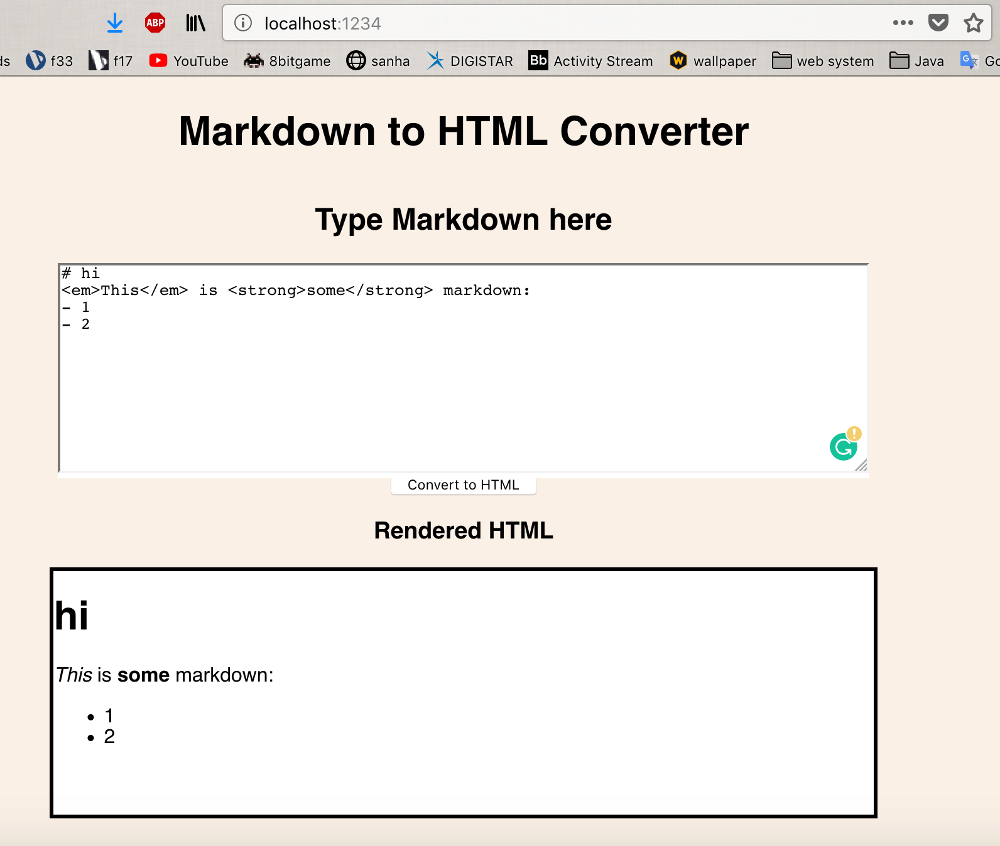
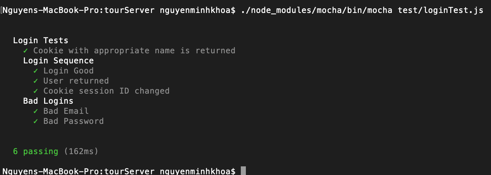
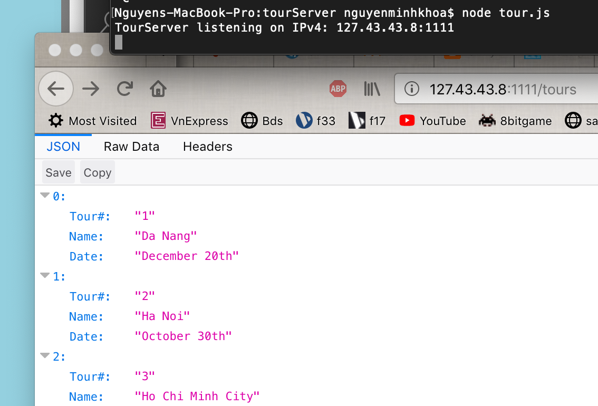
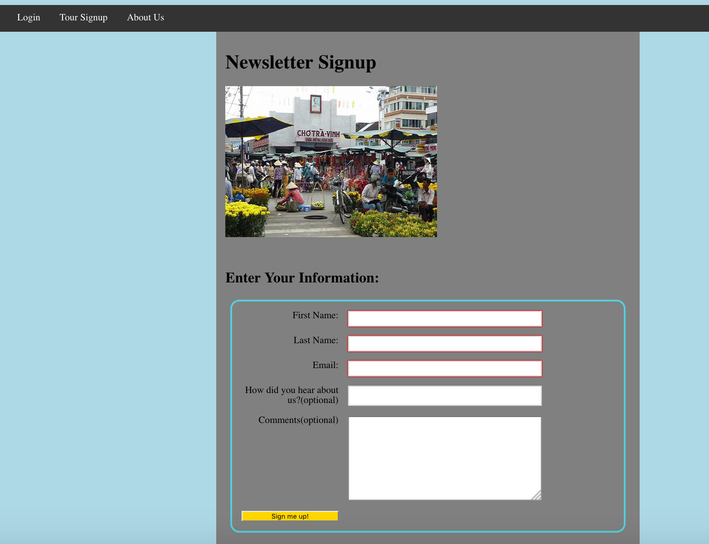
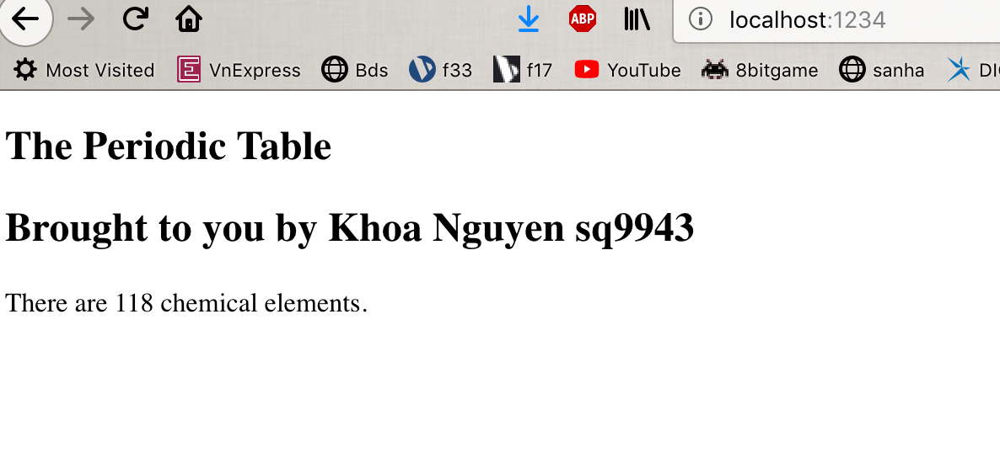

**Student Name**:  Khoa Nguyen

**NetID**: sq9943

# Homework #10 Solutions

## Question 1 

### (a) See all tours
HTTP GET

/tours

Success: 200 (OK)

Error: 404 (NOT FOUND), 400 (BAD REQUEST)

Roles: guest, admin, customer

### (b) Get info on a specific tour
HTTP GET

/tours/{tourId}

Success: 200 (OK)

Error: 404 (NOT FOUND), 400 (BAD REQUEST)

Roles: guest, admin, customer

### (c) Add a new tour
HTTP POST

/tours

Success: 201 (CREATED)

Error: 400 (BAD REQUEST)

Roles: admin

### (d) Edit a tour
HTTP PUT

/tours/{tourId}

Success: 200 (OK), 204 (NO CONTENT)

Error: 404 (NOT FOUND)

Roles: admin


### (e) Delete a tour
HTTP DELETE

/tours/{tourId}

Success: 200 (OK)

Error: 404 (NOT FOUND)

Roles: admin


## Question 2

### (a) Allow a user to see all the tours they are signed up for
HTTP GET

/users/{userId}/signed-up-tours

Success: 200 (OK)

Error: 404 (NOT FOUND)

Role: customer

### (b) Allow a user to signup (only themselves) for a tour (if there is room)
HTTP POST

/users/{userId}/signed-up-tours

Success: 201 (CREATE)

Error: 400 (BAD REQUEST)

Role: customer

### (c) Allow a user to remove themselves from a tour (only themselves, if they are signed up)
HTTP DELETE

/users/{userId}/signed-up-tours/{tourId}

Success: 200 (OK)

Error: 404 (NOT FOUND)

Role: customer

### (d) Get all the customers signed up on a particular tour
HTTP GET

/users/{adminId}/tours/{tourId}/signed-up-customers

Success: 200 (OK)

Error: 404 (NOT FOUND)

Role: admin

## Question 3
### (a)

```code
npm install --save-dev mocha
npm install --save-dev chai
npm install --save-dev supertest
npm install --save-dev cookie
```

```code
//tourServer.js
const express = require('express');
const session = require('express-session');
const DataStore = require('nedb-promises');
const db = DataStore.create(__dirname + '/toursDB');
const db2 = DataStore.create(__dirname + '/usersDB');

let app = express();

const cookieName = "sq9943";
app.use(session({
    secret: 'khoa',
    resave: false,
    saveUninitialized: false,
    name: cookieName
}));

const setUpSessionMiddleware = (req, res, next) => {
    console.log(`session object: ${JSON.stringify(req.session)}`);
    console.log(`session id: ${req.session.id}`);
    if (!req.session.user) {
        req.session.user = {role: "guest"};
    };
    next();
};

const checkAdminMiddleware = (req, res, next) => {
    if (req.session.user.role !== "admin") {
        res.status(403).json({error: "Forbidden/Not permitted"});
    } else {
        next();
    }
};

app.use(setUpSessionMiddleware);

app.get('/tours', async (req, res) => {
    try {
    let find = await db.find({});
    console.log(`We found ${find.length} documents`);
    console.log(find);
    res.json(find);
    } catch (err) {
        console.log(`Database error: ${err}`);
    }
});

app.post('/addTours', checkAdminMiddleware, express.json(), async (req, res) => {
    try {
    let tour = req.body;
    console.log(JSON.stringify(tour));
    let newDocs = await db.insert(tour);
    console.log(`Added tours:`);
    console.log(newDocs);
    let find = await db.find({});
    console.log(`We found ${find.length} documents`);
    console.log(find);
    res.json(find);
    } catch (err) {
        console.log(`Database error: ${err}`);
    }
});


app.post('/login', express.json(), async (req, res) => {
    try {
    console.log(req.body);
    let Email = req.body.email;
    let Password = req.body.password;
    
    let auser = await db2.findOne({email: Email});
    if (!auser) {
        res.status(401).json({error: true, message: "User/Password error"});
        return;
    }
    if (Password === auser.password) {
        let oldInfo = req.session.user;
        req.session.regenerate(function (err) {
            if (err) {console.log(err);
            }
        let newUserInfo = Object.assign(oldInfo, auser);
        delete newUserInfo.password;
        req.session.user = newUserInfo;
        res.json(newUserInfo);
    });
    } else {
        res.status(401).json({error: true, message: "User/Password error"});
    }
    } catch (err) {
        console.log(`Database error: ${err}`);
    }
});

app.get('/logout', (req, res) => {
    let options = req.session.cookie;
    req.session.destroy(function (err) {
        if (err) {
            console.log(err);
        }
        res.clearCookie(cookieName, options);
        res.json({message: "Goodbye"});
    })
});

module.exports = app;
```

```code
//serverRun.js
const app = require('./tourServer');
const host = '127.43.43.8';
const port = '1111';
app.listen(port, host, function () {
	console.log("Tour JSON session server listening on IPv4: " + host +
		":" + port);
});
```

### (b)



### (c)



## Question 4
### (a)



```code
describe('Get All Tour Tests', function () {
	let response;
	let tours = null;
	before(async function(){
		response = await request(app).get('/tours');
	})
	it('Everything is OK', async function(){
		assert.equal(response.status, 200);
	});
	it('Returns an array', function(){
		tours = JSON.parse(response.text);
		assert.isArray(tours);
	});
	it('All tour elements have name and date', function(){
		tours.forEach(function(tour){
			assert.containsAllKeys(tour, ['Name', 'Date']);
		});
	});
	it('Cookie with appropriate name is returned', function(){
		let cookies = response.header['set-cookie'].map(cookie.parse);
		let mycookie = cookies.filter(c => c.hasOwnProperty('sq9943'));
		assert.notEmpty(mycookie);
	});
})

describe('Get an individual tour', function () {
	let response;
	let tours = null;
	before(async function(){
		response = await request(app).get('/tours');
	})
	it('Get an existing tour', async function(){
		console.log(`Trying path: /tours/ddYg4JaOqthBcHOM`);
		tours = JSON.parse(response.text);
		let a = tours.filter(t => t._id === 'ddYg4JaOqthBcHOM' );
		console.log(a);
		assert.notEmpty(a);
	});
	it('Get another existing tour', function(){
		console.log(`Trying path: /tours/i8D2bBXR5WJCB97f`);
		let b = tours.filter(t => t._id === 'i8D2bBXR5WJCB97f' );
		console.log(b);
		assert.notEmpty(b);
	});
	it('Try getting a non-existing tour', function(){
		console.log(`Trying path: /tours/nonExistingTourId`);
		let b = tours.filter(t => t._id === 'nonExistingTourId' );
		console.log(b);
		assert.empty(b);
	});
})
```

### (b)



## Question 5
### (a)



```code
//test code

const initDB = require('../tourDBInit');
const app = require('../tourServer');
const assert = require('chai').assert;
const request = require('supertest'); 
const cookie = require('cookie');
const tourDB = require('../tourDBRef');

describe('Add Tour Tests', function () {
    let res0, res1, res2;
    let tours = null;
    let agent = request.agent(app);
    before(async function(){
        res0 = await initDB();
    })
    it('Login as admin, add tour', async function(){
        res1 = await agent.post('/login')
            .send({"email": "sided1830@outlook.com", "password": "C}m8\"L,F"});
        console.log(res1.text);
        res2 = await agent.post('/addTours')
            .send({"Name": "KhoaNguyenTour", "Date": "HappyThanksGivingDay2019"});
        let a = await tourDB.find({});
        assert.equal(a.length, 4);
    });
    it('Guest try to add tour', async function(){
        res1 = await agent.get('/logout');
        res2 = await agent.post('/addTours')
            .send({"Name": "KhoaNguyenTour", "Date": "HappyThanksGivingDay2019"});
        console.log(res2.text);
        let a = await tourDB.find({});
        assert.equal(a.length, 4);
    });
    it('Customer try to add tour', async function(){
        res1 = await agent.post('/login')
            .send({"email": "sylvan2059@live.com", "password": "1wQX_lYt"});
        console.log(res1.text);
        res2 = await agent.post('/addTours')
            .send({"Name": "KhoaNguyenTour", "Date": "HappyThanksGivingDay2019"});
        console.log(res2.text);
        let a = await tourDB.find({});
        assert.equal(a.length, 4);
    });
})
```