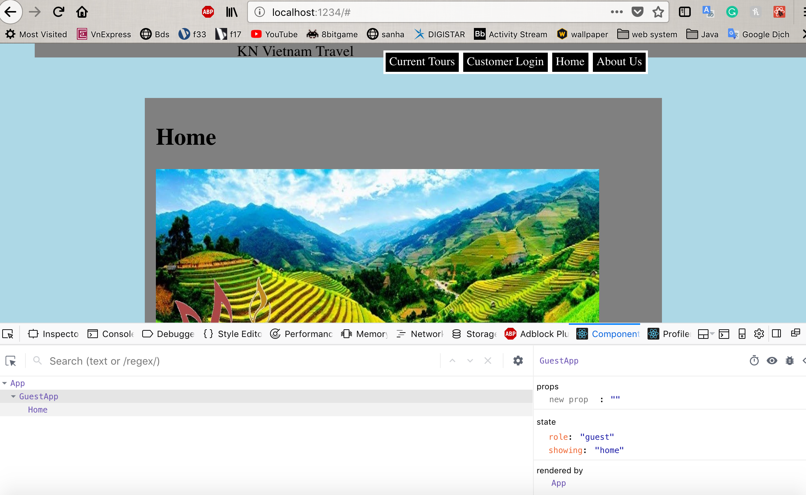
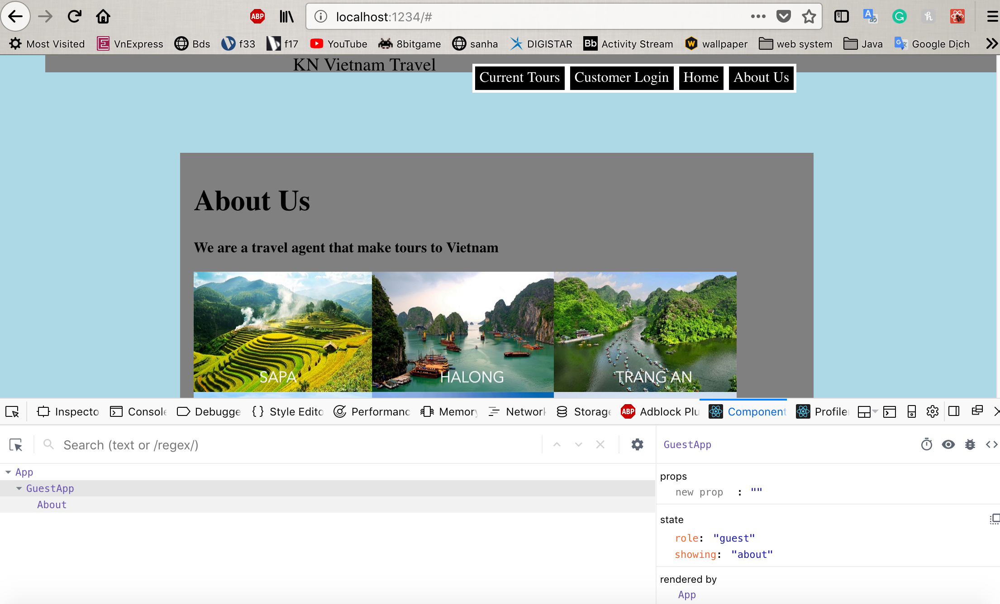
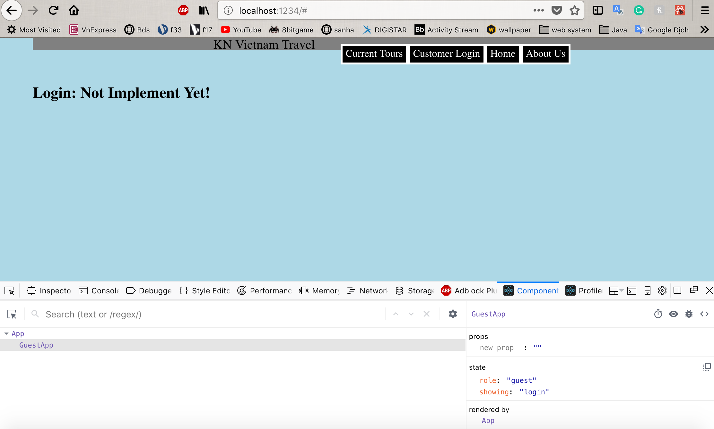

**Student Name**:  Khoa Nguyen

**NetID**: sq9943

# Homework #6 Solutions

## Question 1 
### (a)


### (b)


### (c)

### (d)
```javascript
constructor(props) {
        super(props);
        this.state = {role: "admin", showing: "tour", add: false, modifyTour: true, addName: "", addDate: ""};
        this.addHandler = this.addHandler.bind(this);
        this.adding = this.adding.bind(this);
    }
```
### (e)
```javascript
<input onClick={this.addHandler.bind(this)} type="button" value="Add Tour" />
                    {this.state.add &&
                    <form>
                    <fieldset>
                    <legend>Fill out the info below</legend>
                    <label>Name:</label><input ref={el1 => this.element1 = el1} type="text" size="50" /><br /><br />
                    <label>Date:</label><input ref={el2 => this.element2 = el2} type="text" size="50" /><br /><br />
                    <input onClick={this.adding.bind(this)} type="button" value="ADD" /><br />
                    </fieldset>
                    </form>
                    }
```

### (f)
```javascript
addHandler(event){
        this.setState({add: !this.state.add});
        }
    adding(event){
        this.setState({addName: this.element1.value });
        this.setState({addDate: this.element2.value });
        let anchors = {"Name" : this.element1.value, "Date" : this.element2.value};
        fs = require("fs");
        fs.writeFile("../guest/tours.json", JSON.stringify(anchors, null, 4));
        }
```

## Question 2
### (a)

### (b)







```javascript
import React from "react";
import ReactDOM from "react-dom";
import Home from './Home';
import About from './About';
class GuestApp extends React.Component {
    constructor(props) {
        super(props);
        this.state = {role: "guest", showing: "home"}; // We will have "user" and "admin" roles too.
    }
    
    homeHandler(event){
    this.setState({showing: "home"});
    }

    aboutHandler(event){
    this.setState({showing: "about"});
    }

    loginHandler(event){
    this.setState({showing: "login"});
    }

    render() {
        let contents = null;
        switch (this.state.showing) {
            case "home":
                contents = <Home />;
                break;
            case "about":
                contents = <About />;
                break;
            case "login":
                contents = <h2>Login: Not Implement Yet!</h2>;
                break;
            default:
                contents = <h2>WWarning! Something was wrong, again!</h2>;
        }

        return (
        <div>
        <nav id="bar">
            <span id="s1">KN Vietnam Travel</span>
            <ul>
            <li><a href="#">Current Tours</a></li>
            <li><a href="#" onClick={this.loginHandler.bind(this)}>Customer Login</a></li>
            <li><a href="#" onClick={this.homeHandler.bind(this)}>Home</a></li>
            <li><a href="#" onClick={this.aboutHandler.bind(this)}>About Us</a></li>
            </ul>
            </nav>
        {contents}
        </div>
        );    
	}
}
export default GuestApp;
```

## Question 3
### (a) Your Network Interfaces


### (b1) Ethernet Address of your machine(s)


### (b2) Type of IP Addresses of your machine


### (c) IP Address of a public website - csueastbay.edu 

```code
134.154.136.39
```
### (d) Where is the server?


## Question 4
### (a)

2 purposes:

-Pointing to an instance of an object from its own constructor or its methods. 

-Keeping track of execution context — which is often based on where a function was called from.

### (b)

#### Code added in App
```javascript
class App extends React.Component {
    constructor(props) {
        super(props);
        this.state = {role: "guest"}; // We will have "user" and "admin" roles too.
        this.handleLogin = this.handleLogin.bind(this);
        this.handleLogout = this.handleLogout.bind(this);
    }
    

    handleLogin(role,info){

        if (role === "admin"){
            this.setState({role: "admin",user: info}) 
        } 
        else if (role ==="customer"){
            this.setState({role: "customer",user: info})
        }
    }

    handleLogout(){
        this.setState({role: "guest",user: null})
        
    }
    
    render() {

        let contents = null;
        switch (this.state.role) {
            case "guest":
                contents = <GuestApp handleLogin = {this.handleLogin} />;
                break;
            case "customer":
                contents = <CustomerApp handleLogout = {this.handleLogout} />;
                break;
            case "admin":
                contents = <AdminApp handleLogout = {this.handleLogout}/>;
                break;
            default:
                contents = <h2>Warning something went wrong!!!</h2>;
            }
        return (
        <div>
        {contents}
        </div>
        );
    }
}
```

#### Code added in Login
```javascript
class Login extends React.Component {
    constructor(props) {
        super(props);
        this.state = {role: "guest", email: "", password: ""}; // We will have "user" and "admin" roles too.
        this.loginHandler = this.loginHandler.bind(this);
    }
    
    loginHandler(event){
    this.setState({email: this.element1.value });
    this.setState({password: this.element2.value });
    }

    render() {
        let contents = null;
        switch (this.state.email) {
            case "admin@gmail.org":
            this.props.handleLogin("admin",{name: "Khoa",Id: "sq9943"});
            break;
            case "customer":
            this.props.handleLogin("customer",{name: "Khoa",Id: "sq9943"});
            break;
            default:
                contents = (
            <main>
            <header>
            <h1>Login Site</h1>
            </header>
            <form>
            <label>Email:</label><input ref={el1 => this.element1 = el1} type="text" /><br /><br />
            <label>Password:</label><input ref={el2 => this.element2 = el2} type="password" /><br /><br />
            <input onClick={this.loginHandler.bind(this)} type="button" value="Login" />
            </form>
            </main>
                    );
            }
        return (
        <div>
            {contents}
        </div>
        );    
    }
}
```

### (c)

```javascript
<li><a href="#" onClick={this.props.handleLogout}>Logout</a></li>
```
