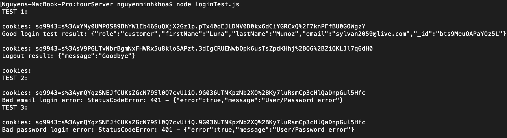

**Student Name**:  Khoa Nguyen

**NetID**: sq9943

# Homework #9 Solutions

## Question 1 
### (a) 

```code
const DataStore = require('nedb-promises');
const db = DataStore.create(__dirname + '/usersDB');
const users = require('./users.json');

async function initialize() {
    try {
        let numRemoved = await db.remove({}, {multi: true});
        console.log(`Cleanup, removed ${numRemoved} users`);
        let newDocs = await db.insert(users);
        console.log(`Added ${newDocs.length} users`);
    } catch (err) {
        console.log(`Database error: ${err}`);
    }
}

initialize();
```

### (b)

```code
const DataStore = require('nedb-promises');
const db = DataStore.create(__dirname + '/toursDB');
const tours = require('./tours.json');

async function initialize() {
    try {
        let numRemoved = await db.remove({}, {multi: true});
        console.log(`Cleanup, removed ${numRemoved} tours`);
        let newDocs = await db.insert(tours);
        console.log(`Added ${newDocs.length} tours`);
    } catch (err) {
        console.log(`Database error: ${err}`);
    }
}

initialize();
```

## Question 2
### (a)
```code
app.get('/tours', async (req, res) => {
    try {
    let find = await db.find({});
    console.log(`We found ${find.length} documents`);
    console.log(find);
    res.json(find);
    } catch (err) {
        console.log(`Database error: ${err}`);
    }
});
```

### (b)
```code
app.post('/addTours', express.json(), async (req, res) => {
    try {
    let tour = req.body;
    console.log(JSON.stringify(tour));
    let newDocs = await db.insert(tour);
    console.log(`Added tours:`);
    console.log(newDocs);
    let find = await db.find({});
    console.log(`We found ${find.length} documents`);
    console.log(find);
    res.json(find);
    } catch (err) {
        console.log(`Database error: ${err}`);
    }
});
```
### (c)


## Question 3
### (a)

```code
const session = require('express-session');
const cookieName = "sq9943";
app.use(session({
    secret: 'khoa',
    resave: false,
    saveUninitialized: false,
    name: cookieName
}));

const setUpSessionMiddleware = (req, res, next) => {
    console.log(`session object: ${JSON.stringify(req.session)}`);
    console.log(`session id: ${req.session.id}`);
    if (!req.session.user) {
        req.session.user = {role: "guest"};
    };
    next();
};

app.use(setUpSessionMiddleware);
```

### (b)


### (c)

```code
app.post('/login', express.json(), async (req, res) => {
    try {
    console.log(req.body);
    let Email = req.body.email;
    let Password = req.body.password;
    
    let auser = await db2.findOne({email: Email});
    if (!auser) {
        res.status(401).json({error: true, message: "User/Password error"});
        return;
    }
    if (Password === auser.password) {
        let oldInfo = req.session.user;
        req.session.regenerate(function (err) {
            if (err) {console.log(err);
            }
        let newUserInfo = Object.assign(oldInfo, auser);
        delete newUserInfo.password;
        req.session.user = newUserInfo;
        res.json(newUserInfo);
    });
    } else {
        res.status(401).json({error: true, message: "User/Password error"});
    }
    } catch (err) {
        console.log(`Database error: ${err}`);
    }
});
```

### (d)

```code
app.get('/logout', function (req, res) {
    let options = req.session.cookie;
    req.session.destroy(function (err) {
        if (err) {
            console.log(err);
        }
        res.clearCookie(cookieName, options); // the cookie name and options
        res.json({message: "Goodbye"});
    })
});
```
### (e)

```code
const rp = require('request-promise-native');
const cookieJar = rp.jar();
let tourSite = {
    uri: 'http://127.43.43.8:1111/tours',
    json: true,
    jar: cookieJar
};

let logout = { 
    uri: 'http://127.43.43.8:1111/logout', 
    json: true,
    jar: cookieJar
}; 

let loginGood = {
    uri: 'http://127.43.43.8:1111/login',
    json: true,
    method: "POST",
    body: {"email": "sylvan2059@live.com",
    "password": "1wQX_lYt"},
    jar: cookieJar
};

let loginBadEmail = {
    uri: 'http://127.43.43.8:1111/login',
    json: true,
    method: "POST",
    body: {"email": "sylvan205@live.com",
    "password": "1wQX_lYt"},
    jar: cookieJar
};

let loginBadPass = {
    uri: 'http://127.43.43.8:1111/login',
    json: true,
    method: "POST",
    body: {"email": "sylvan2059@live.com",
    "password": "2wQX_lYt"},
    jar: cookieJar
};


async function someTests() {
    let res1, res2, res3;
    try {
        console.log(`TEST 1:\n`);
        res1 = await rp(tourSite);
        console.log(`cookies: ${cookieJar.getCookieString(tourSite.uri)}`);
        res2 = await rp(loginGood);
        console.log(`Good login test result: ${JSON.stringify(res2)}\n`);
        console.log(`cookies: ${cookieJar.getCookieString(loginGood.uri)}`);
        res3 = await rp(logout);
        console.log(`Logout result: ${JSON.stringify(res3)}\n`);
        console.log(`cookies: ${cookieJar.getCookieString(logout.uri)}`);
    } catch (error) {
    console.log(`Good login error: ${error}\n`);
    }
    try {
        console.log(`TEST 2:\n`);
        res1 = await rp(tourSite);
        console.log(`cookies: ${cookieJar.getCookieString(tourSite.uri)}`);
        res2 = await rp(loginBadEmail);
        console.log(`Bad email login test result: ${JSON.stringify(res2)}\n`);
        console.log(`cookies: ${cookieJar.getCookieString(loginBadEmail.uri)}`);
    } catch (error) {
    console.log(`Bad email login error: ${error}`);
    }
    try {
        console.log(`TEST 3:\n`);
        res1 = await rp(tourSite);
        console.log(`cookies: ${cookieJar.getCookieString(tourSite.uri)}`);
        res2 = await rp(loginBadPass);
        console.log(`Bad password login test result: ${JSON.stringify(res2)}\n`);
        console.log(`cookies: ${cookieJar.getCookieString(loginBadPass.uri)}`);
    } catch (error) {
    console.log(`Bad password login error: ${error}\n`);
    }
}

someTests();
```




## Question 4
### (a)

```code
const checkAdminMiddleware = (req, res, next) => {
    if (req.session.user.role !== "admin") {
        res.status(403).json({error: "Forbidden/Not permitted"});
    } else {
        next();
    }
};
```
