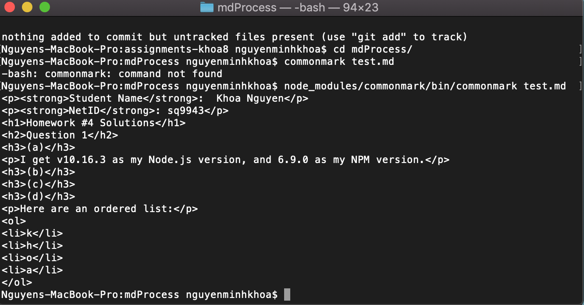

**Student Name**:  Khoa Nguyen

**NetID**: sq9943

# Homework #4 Solutions

## Question 1 
### (a)

I get v10.16.3 as my Node.js version, and 6.9.0 as my NPM version.

### (b)

### (c)

### (d)



## Question 2
### (a)

### (b)


### (c)


## Question 3
### (a)

### (b)

```html
<body>
    <h1>Markdown to HTML Converter</h1>
  	<h2>Type Markdown here</h2>

<div id="d1">
	<textarea name="comments" id="input" rows="11" cols="80" wrap=on></textarea>
	
</div>
	<button type="button" id="b1">Convert to HTML</button>
	<h3>Rendered HTML</h3>
<div id="d2">
	
</div>


</body>
```

```javascript
import commonmark from "commonmark";

function convert(){

var reader = new commonmark.Parser();
var writer = new commonmark.HtmlRenderer();
var parsed = reader.parse(document.getElementById("input").value);
var result = writer.render(parsed);

document.getElementById("d2").innerHTML +=result;
}

window.onload = function() {
  document.getElementById("b1").addEventListener("click",convert);
}
```


## Question 4
### (a)

We can import CSS to the js file. Because the build tool processes CSS from JavaScript entry point, we can import the stylesheet directly into CommonJS-module.

### (b)

```javascript
import commonmark from "commonmark";
import hljs from 'highlight.js';
import 'highlight.js/styles/idea.css';

function convert(){

var reader = new commonmark.Parser();
var writer = new commonmark.HtmlRenderer();
var parsed = reader.parse(document.getElementById("input").value);
var result = writer.render(parsed);
document.getElementById("d2").innerHTML +=result;
document.querySelectorAll('div').forEach((block) => {
    hljs.highlightBlock(block);
  });
}

window.onload = function() {
  document.getElementById("b1").addEventListener("click",convert);
}
```


### (c)

[Markdown2HTML App](http://csweb01.csueastbay.edu/~sq9943/hw4/processMD.html).

### (d)

processMD.e3785419.js 1.3 MB

processMD.e3785419.css 1 KB

To reduce the size of the JavaScript file:
- Using server side compression.
- Short Coding.
- Using tools: Javascript Online Minifier Tool; CSS Minifier/Minify Tool.
- Including CSS and JavaScript as files instead of inline or at the head of each page.
[from stackoverflow](https://stackoverflow.com/questions/65491/what-is-the-best-method-to-reduce-the-size-of-my-javascript-and-css-files)

## Question 5
### (a) 


```javascript
import React from "react";
import ReactDOM from "react-dom";
import chemElements from "./elements.json";

// What is this? HTML mixed with JavaScript
let head1 = <h1>The Periodic Table</h1>;
let head2 = <h2>Brought to you by Khoa Nguyen sq9943</h2>;
let intro = <p>There are 118 chemical elements.</p>;

ReactDOM.render(<section>
    {head1}
    {head2}
    {intro}
    </section>,
    document.getElementById("root")
);
```

### (b)


