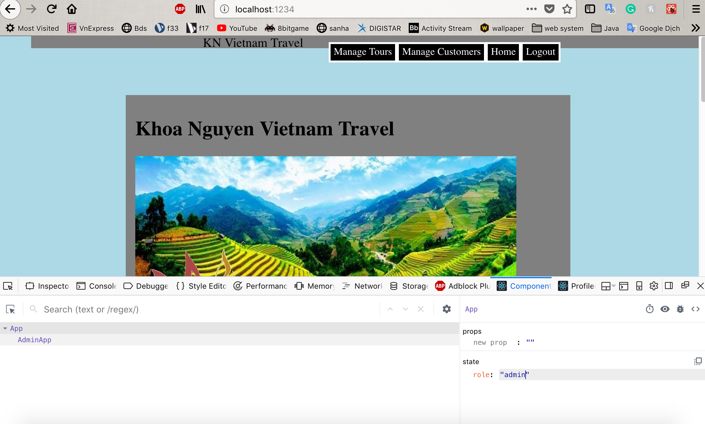

**Student Name**:  Khoa Nguyen

**NetID**: sq9943

# Homework #5 Solutions

## Question 1 
### (a)

### (b)


### (c)




### (d)
```javascript
import React from "react";
import ReactDOM from "react-dom";
import GuestApp from './GuestApp';
import CustomerApp from './CustomerApp';
import AdminApp from './AdminApp';
class App extends React.Component {
    constructor(props) {
        super(props);
        this.state = {role: "guest"}; // We will have "user" and "admin" roles too.
    }
    // Renders component based on current state and props
    render() {
//         return (
//             <div>
//             <h2>OOOOOOOP </h2>
//             <AdminApp />
//             </div>
// );
        let contents = null;
        switch (this.state.role) {
            case "guest":
                contents = <GuestApp />;
                break;
            case "customer":
                contents = <CustomerApp />;
                break;
            case "admin":
                contents = <AdminApp />;
                break;
            default:
                contents = <h2>Warning something went wrong!!!</h2>;
            }
        return (
        <div>
        {contents}
        </div>
        );
    }
}
ReactDOM.render(<App />, document.getElementById("root"));
```
## Question 2
### (a)

### (b)


```javascript
import React from "react";
import ReactDOM from "react-dom";
import Home from './Home';
import About from './About';
class GuestApp extends React.Component {
    constructor(props) {
        super(props);
        this.state = {role: "guest", showing: "home"}; // We will have "user" and "admin" roles too.
    }
    
    homeHandler(event){
    this.setState({showing: "home"});
    }

    aboutHandler(event){
    this.setState({showing: "about"});
    }

    loginHandler(event){
    this.setState({showing: "login"});
    }

    render() {
        let contents = null;
        switch (this.state.showing) {
            case "home":
                contents = <Home />;
                break;
            case "about":
                contents = <About />;
                break;
            case "login":
                contents = <h2>Login: Not Implement Yet!</h2>;
                break;
            default:
                contents = <h2>WWarning! Something was wrong, again!</h2>;
        }

        return (
        <div>
        <nav id="bar">
            <span id="s1">KN Vietnam Travel</span>
            <ul>
            <li><a href="#">Current Tours</a></li>
            <li><a href="#" onClick={this.loginHandler.bind(this)}>Customer Login</a></li>
            <li><a href="#" onClick={this.homeHandler.bind(this)}>Home</a></li>
            <li><a href="#" onClick={this.aboutHandler.bind(this)}>About Us</a></li>
            </ul>
            </nav>
        {contents}
        </div>
        );    
	}
}
export default GuestApp;
```

## Question 3
### (a)


### (b)


## Question 4
### (a)

We can import CSS to the js file. Because the build tool processes CSS from JavaScript entry point, we can import the stylesheet directly into CommonJS-module.

### (b)

```javascript
import commonmark from "commonmark";
import hljs from 'highlight.js';
import 'highlight.js/styles/idea.css';

function convert(){

var reader = new commonmark.Parser();
var writer = new commonmark.HtmlRenderer();
var parsed = reader.parse(document.getElementById("input").value);
var result = writer.render(parsed);
document.getElementById("d2").innerHTML +=result;
document.querySelectorAll('div').forEach((block) => {
    hljs.highlightBlock(block);
  });
}

window.onload = function() {
  document.getElementById("b1").addEventListener("click",convert);
}
```


### (c)

[Markdown2HTML App](http://csweb01.csueastbay.edu/~sq9943/hw4/processMD.html).

### (d)

processMD.e3785419.js 1.3 MB

processMD.e3785419.css 1 KB

To reduce the size of the JavaScript file:
- Using server side compression.
- Short Coding.
- Using tools: Javascript Online Minifier Tool; CSS Minifier/Minify Tool.
- Including CSS and JavaScript as files instead of inline or at the head of each page.
[from stackoverflow](https://stackoverflow.com/questions/65491/what-is-the-best-method-to-reduce-the-size-of-my-javascript-and-css-files)

## Question 5
### (a) 


```javascript
import React from "react";
import ReactDOM from "react-dom";
import chemElements from "./elements.json";

// What is this? HTML mixed with JavaScript
let head1 = <h1>The Periodic Table</h1>;
let head2 = <h2>Brought to you by Khoa Nguyen sq9943</h2>;
let intro = <p>There are {parseInt(chemElements.length)} chemical elements.</p>;

ReactDOM.render(<section>
    {head1}
    {head2}
    {intro}
    </section>,
    document.getElementById("root")
);

```
### (b)

I'm sorry, cannot solve this question at this time. My code has still messed up.

