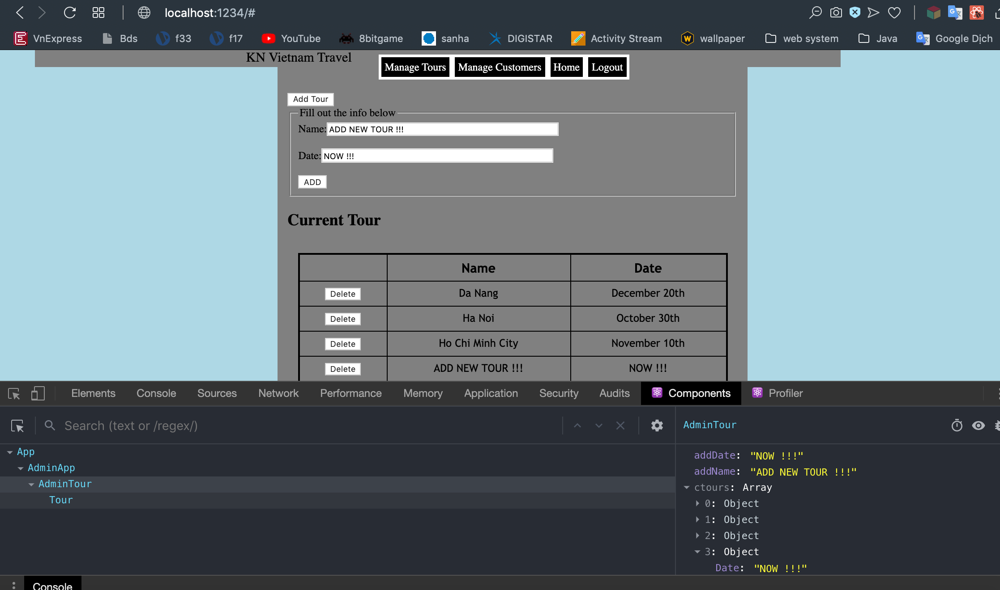
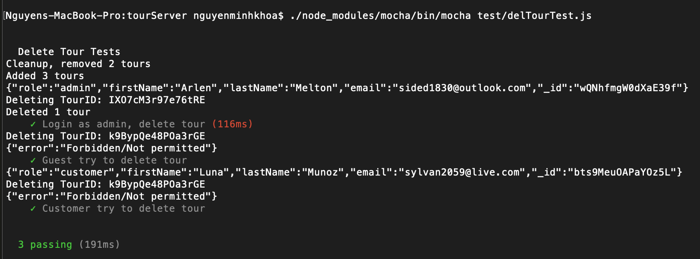

**Student Name**:  Khoa Nguyen

**NetID**: sq9943

# Homework #3 Solutions

## Question 1 
### (a)

With the "<script src="drawing.js"></script>" in the <head> part, the html will show nothing because of the order matter of the js file and the HTML body. To make the code works, simply put the "<script src="drawing.js"></script>" in the body part, right before the </body>.

Another solution is using window.onload: create a function in the js file, and at the end of the file, we use window.onload command.

```javascript
function drawing(){
var x = 0;
  var y = 0;
  var size = 0;
  var fill = '000000';  
  var temp = '';
  var svg = '';
  for( var i = 0 ; i < 70 ; i++ ){
      x = Math.floor(Math.random() * (1400-100+1)+ 100);
      y = Math.floor(Math.random() * (1400-100+1)+ 100);
      size = Math.floor(Math.random() * (70-10+1)+ 10);
      fill = Math.floor(Math.random()*16777215).toString(16); 
      text = "<circle cx='"+ x +"' cy='" + y + "' r='" + size + "' fill='#" + fill + "'/>";
      //text = "<circle cx='50' cy='50' r='50' fill='red'/>";
      temp = temp  +  text;       
  }
  //svg ="<svg id='svg' height='500' width='700'>" + temp + "</svg>";
  document.getElementById("MyDrawing").innerHTML += temp;
}
window.onload = drawing;
```
### (b)

### (c)
#### HTML of inputs and buttons
```html
  <form>
  <label for="drawcir">Number of Circles:</label>
  <input type="number" id="drawcir" name="drawcir" placeholder="from 1 to 20" min="1" max="20" autocomplete="off">
  <input type="button" class="button" id="b1" value="Add Circle(s)">

  <label for="drawsqu">Number of Squares:</label>
  <input type="number" id="drawsqu" name="drawsqu" placeholder="from 1 to 20" min="1" max="20" autocomplete="off">
  <input type="button" class="button" id="b2" value="Add Square(s)">
</form>
```

#### JavaScript of two event handlers
```javascript
function draw_cir(){
  let n1 = document.getElementById("drawcir").value;
  var x = 0;
  var y = 0;
  var size = 0;
  var fill = '000000';  
  var temp = '';
  var svg = '';
  for( let i = 0 ; i < n1; i++ ){
      x = Math.floor(Math.random() * (700-100+1)+ 100);
      y = Math.floor(Math.random() * (300-100+1)+ 100);
      size = Math.floor(Math.random() * (40-10+1)+ 10);
      fill = Math.floor(Math.random()*16777215).toString(16); 
      text = "<circle cx='"+ x +"' cy='" + y + "' r='" + size + "' fill='#" + fill + "'/>";
      //text = "<circle cx='50' cy='50' r='50' fill='red'/>";
      temp = temp  +  text;       
  }
  //svg ="<svg id='svg' height='500' width='700'>" + temp + "</svg>";
  document.getElementById("MyDrawing").innerHTML += temp;
}


function draw_squ(){
  let n2 = document.getElementById("drawsqu").value;
  var maxSize = 50,
      maxX = 800,
      maxY = 300;
  for( let i = 0; i < n2; i++) {
  let x = Math.random()*(maxX - maxSize);
  let y = Math.random()*(maxY - maxSize);
  let width = Math.random()*maxSize;
  let square = document.createElementNS("http://www.w3.org/2000/svg", "rect");
  square.setAttribute("x", x);
  square.setAttribute("y", y);
  square.setAttribute("width", width);
  square.setAttribute("height", width);
  let colorStr = `rgb(${255*Math.random()}, ${255*Math.random()}, ${255*Math.random()})`;
  square.setAttribute("fill", colorStr);
  square.setAttribute("fill-opacity", 0.7);
  document.getElementById("MyDrawing").appendChild(square);
}
}

window.onload = function() {
  document.getElementById("b1").addEventListener("click",draw_cir);
  document.getElementById("b2").addEventListener("click",draw_squ);
}
```




## Question 2
### (a)
```javascript
while(myElement.firstChild){myElement.removeChild(myElement.firstChild);}
```
While the element still has a child ("myElement.firstChild"), this command will continue to loop and remove the first child of it. Using while loop will avoid the null if the node does not exist which means all the children of this element have been removed. Also we can use childNodes[0] will produce the same result as firstChild.

```javascript
function clear(){
const myElement = document.getElementById("MyDrawing");
while(myElement.firstChild){myElement.removeChild(myElement.firstChild);}
}

document.getElementById("b3").addEventListener("click",clear);
```

### (b)

#### Added HTML
```html
<label for="opac">Shape Opacity:</label>
<input type="number" id="opac" name="opac" placeholder="0.0 to 1.0; default is 1.0" step="0.1" min="0.0" max="1.0" autocomplete="off">
```

#### JavaScript initialization additions
```javascript
function draw_cir(){

let opa = document.getElementById("opac").value;
...
...
text = "<circle cx='"+ x +"' cy='" + y + "' r='" + size + "' fill='#" + fill + "' fill-opacity='" + opa + "'/>";
```
```javascript
function draw_squ(){
...
...
  let opa = document.getElementById("opac").value;
...
...
  square.setAttribute("fill-opacity", opa);
```

#### Event handler code
```javascript
window.onload = function() {
  document.getElementById("b1").addEventListener("click",draw_cir);
  document.getElementById("b2").addEventListener("click",draw_squ);
  document.getElementById("b3").addEventListener("click",clear);
}
```

## Question 3
### (a)


```javascript
array=document.querySelectorAll('.publication');
for (var i=0;i<array.length;i++) {
	array[i].innerHTML = '<strong style=\'color:blue;\'>' +(i+1)+ ' (sq9943). </strong>' +array[i].innerText;
}
```

### (b)
```javascript
array=document.querySelectorAll('.patent');
var array2 = [];
for(var i=0;i<array.length;i++){
let o = {};
o.Patent_Number = document.getElementsByClassName('PatNum')[i].innerText;
o.Title = document.getElementsByClassName('Title')[i].innerText;
o.Date = document.getElementsByClassName('Date')[i].innerText;
array2[i] = o;
}
array2;  <!-- call array2 to copy array of objects to the patentInfo.js -->
```

## Question 4
### (a)

### (b)


```javascript
	var x = 0;
	var y = 0;
	var size = 0;
	var fill = '000000';	
	var temp = '';
	var svg = '';
	for( var i = 0 ; i < 70 ; i++ ){
			x = Math.floor(Math.random() * (1400-100+1)+ 100);
			y = Math.floor(Math.random() * (1400-100+1)+ 100);
			size = Math.floor(Math.random() * (70-10+1)+ 10);
			fill = Math.floor(Math.random()*16777215).toString(16);	
			text = "<circle cx='"+ x +"' cy='" + y + "' r='" + size + "' fill='#" + fill + "'/>";
			//text = "<circle cx='50' cy='50' r='50' fill='red'/>";
			temp = temp  +  text;				
	}
	svg ="<svg id='svg' height='500' width='700'>" + temp + "</svg>";
	document.getElementById("circle").innerHTML += svg;
```

## Question 5
### (a) 

### (b)



```javascript

<!-- this is just a hard code for testing the function with out file patentInfo.js
let patentInfo = [
  { PatentNumber: 1, Date: "September", Title: "ABC" },
  { PatentNumber: 2, Date: "September", Title: "ABC" },
  { PatentNumber: 3, Date: "September", Title: "ABC" },
  { PatentNumber: 4, Date: "September", Title: "ABC" },
  { PatentNumber: 5, Date: "September", Title: "ABC" }
];
-->

function generateTableHead(table, data) {
  let thead = table.createTHead();
  let row = thead.insertRow();
  for (let key of data) {
    let th = document.createElement("th");
    let text = document.createTextNode(key);
    th.appendChild(text);
    row.appendChild(th);
  }
}

function generateTable(table, data) {
  for (let element of data) {
    let row = table.insertRow();
    for (key in element) {
      let cell = row.insertCell();
      let text = document.createTextNode(element[key]);
      cell.appendChild(text);
    }
  }
}

let table = document.querySelector("table");
let data = Object.keys(patInfo[0]);
generateTable(table, patInfo);
generateTableHead(table, data);
```