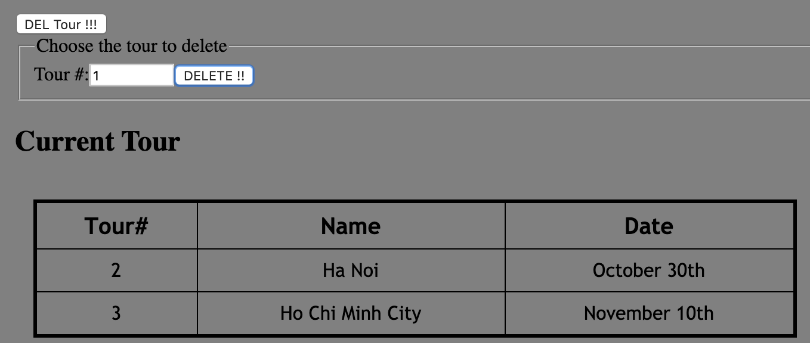
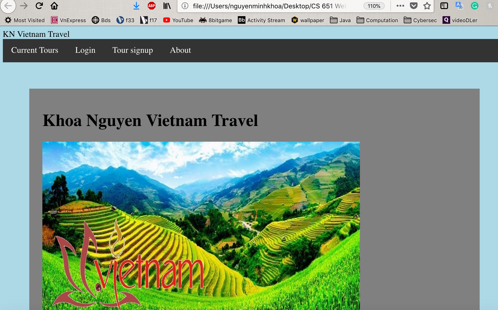
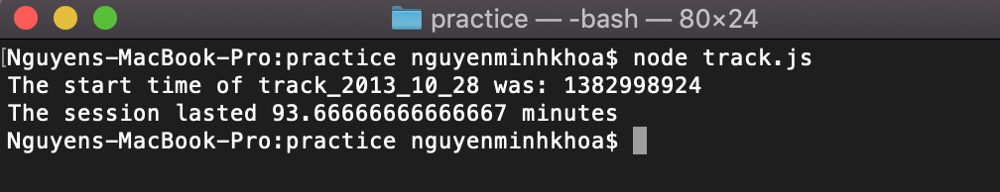
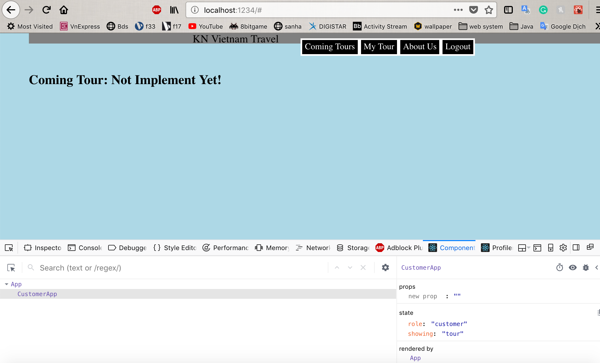
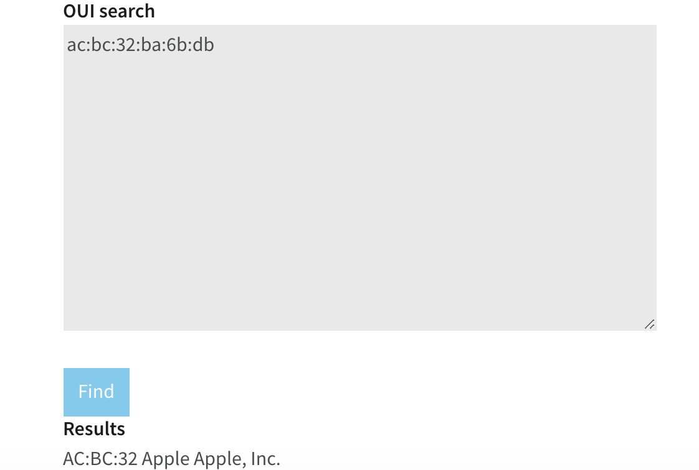
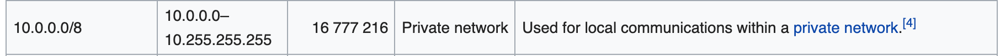
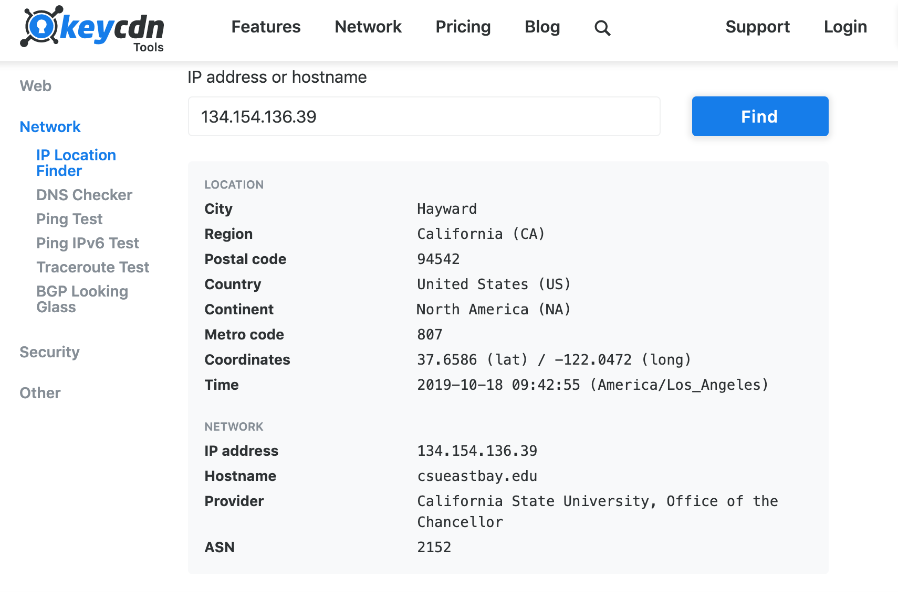

**Student Name**:  Khoa Nguyen

**NetID**: sq9943

# Homework #7 Solutions

## Question 1 
### (a)

What HTTP Method is used in the request?

GET


What is the response code and what does it mean?

200 OK - the request has succeeded


What version of HTTP is being used?

HTTP/1.1

### (b)

Host: bb.csueastbay.edu
User-Agent: Mozilla/5.0 (Macintosh; Intel Mac OS X 10.14; rv:60.0) Gecko/20100101 Firefox/60.0
Accept: text/html,application/xhtml+xml,application/xml;q=0.9,*/*;q=0.8
Accept-Language: en-US,en;q=0.5
Accept-Encoding: gzip, deflate, br
Cookie: __utma=208548673.1534384702.1570070220.1571148140.1571996850.41; __utmz=208548673.1570070220.1.1.utmcsr=(direct)|utmccn=(direct)|utmcmd=(none); _ga=GA1.2.1257877214.1570176796; BbRouter=expires:1571999477,id:F5AC26ED588BB4D7B2FCD6C9E2309FEC,signature:ee8d6355f346978d4a0cb5531ad42d5e87a210a23675996144bfef8c6aeabebd,site:aefdf5db-8c6a-4e8e-8bf7-fb9f1f4dcdf0,v:2,xsrf:eeabd90e-b04c-4071-b961-d85e7abc1560; __utmc=208548673; wl_auth=client_id=00000000481AF445&status=unchecked; AWSELB=D3570BC914533D9ACC5FBEA2A258730F699E691A0ABC1ED62EDAD5455CC53097809BAEF27810D13E1B6171A9A45FB268F2886D59F2857B5EB77FF35146B7D298B9AEF8BA8C; __utmb=208548673.10.10.1571996850; __utmt=1; JSESSIONID=32D6A776DDE822EA8D5662758CEA3EC9
Connection: keep-alive
Upgrade-Insecure-Requests: 1
Cache-Control: max-age=0

### (c)

HTTP/1.1 200 
Cache-Control: private
Cache-Control: max-age=0
Cache-Control: no-store
Cache-Control: must-revalidate
Content-Encoding: gzip
Content-Language: en-US
Content-Security-Policy: frame-ancestors 'self'
Content-Type: text/html;charset=UTF-8
Date: Fri, 25 Oct 2019 10:01:29 GMT
Expires: Thu, 25 Oct 2018 10:01:29 GMT
Last-Modified: Mon, 25 Oct 1999 10:01:29 GMT
P3P: CP="CAO PSA OUR"
Pragma: private
Server: openresty/1.9.3.1
Set-Cookie: BbRouter=expires:1571999489,id:F5AC26ED588BB4D7B2FCD6C9E2309FEC,signature:771f968b01dbc998c7d916051b9dba4b2ab7b4eae8e6d988e1dc6a58e482ca47,site:aefdf5db-8c6a-4e8e-8bf7-fb9f1f4dcdf0,v:2,xsrf:eeabd90e-b04c-4071-b961-d85e7abc1560; Path=/; Secure; HttpOnly
Vary: Accept-Encoding
X-Blackboard-appserver: ip-10-145-51-206.ec2.internal
X-Blackboard-product: Blackboard Learn &#8482; 3700.11.0-rel.17+dca4b12
X-Frame-Options: SAMEORIGIN
Content-Length: 17359
Connection: keep-alive

### (d)

What server is BlackBoard based on?

openresty/1.9.3.1


Are any cookies set? If so what are they.

Set-Cookie: BbRouter=expires:1571999489,id:F5AC26ED588BB4D7B2FCD6C9E2309FEC,signature:771f968b01dbc998c7d916051b9dba4b2ab7b4eae8e6d988e1dc6a58e482ca47,site:aefdf5db-8c6a-4e8e-8bf7-fb9f1f4dcdf0,v:2,xsrf:eeabd90e-b04c-4071-b961-d85e7abc1560; Path=/; Secure; HttpOnly

### (e)

https://developer.mozilla.org/en-US/docs/Web/JavaScript/Guide/Grammar_and_Types#Comments

protocol: https

domain: mozilla.org

port:

path: /en-US/docs/Web/JavaScript/Guide/Grammar_and_Types

query:

fragment: Comments


https://www.google.com/search?q=gaia+mission&rlz=1CYPO_enUS751

protocol: https

domain: google.com

port:

path: /search

query: q=gaia+mission&rlz=1CYPO_enUS751

fragment:


http://127.0.0.2:8282/static/index.html

protocol: http

domain: 127.0.0.2

port: 8282

path: /static/index.html

query:

fragment:

## Question 2
### (a)



```javascript
const request_promise = require('request-promise-native');

let site = {
    uri: 'https://windsurf.grotto-networking.com/data/logs/windEvents2013.json', 
    json: true 
};
    
request_promise(site).then(function(data){ 
    let max10sec = data.map(m => m.max10sec); 
    let distance = data.map(d => d.distance); 
    let s = max10sec.reduce((accumulator, currentValue) => {return Math.max(accumulator, currentValue)}); 
    let d = distance.reduce((accumulator, currentValue) => {return Math.max(accumulator, currentValue)}); 
    console.log(`The number of sailing sessions in 2013 was: ${data.length}`);
    console.log(`The fastest 10 second speed average was: ${s}`); 
    console.log(`The longest single day distance was: ${d}`); 
})
```

### (b)



### (c)



```javascript
const request_promise = require('request-promise-native'); 

let site = { 
    uri: 'https://windsurf.grotto-networking.com/data/tracks/track_2013_10_28.json', 
    json: true }; 
    
request_promise(site).then(function(data){ 
console.log(`The start time of track_2013_10_28 was: ${data.start_time}`);
console.log(`The session lasted ${data.points.length/60} minutes`);
})
```

## Question 3
### (a) Your Network Interfaces



### (b1) Ethernet Address of your machine(s)



### (b2) Type of IP Addresses of your machine



### (c) IP Address of a public website - csueastbay.edu 

```code
134.154.136.39
```
### (d) Where is the server?



## Question 4
### (a)

2 purposes:

-Pointing to an instance of an object from its own constructor or its methods. 

-Keeping track of execution context — which is often based on where a function was called from.

### (b)

this #1 : object Window // In a general function, this refers to the global object.

this #2 : instance of myObj1 pointed from its method // In a method, this refers to the owner object.

this #3 : instance of myObj2 // with bind(), this refers to the wrapped object in bind()

### (c)

```code
Is this the start?
When does this print?
Is this the end?
undefined
this is a msg from CS651
This is a msg from CS351
```
#### Explain:

There are 3 messages in the queue: console.log('Is this the start?'), console.log('When does this print?'), console.log('Is this the end?').
So, the setTimeout messages will have to wait for other messages to be processed eventhough the time values are 0 and default (means 0, too). After that, the setTimeout(cs651) will be printed next because it's on the queue before the setTimeout(cs351, 0); finally, print the message from setTimeout(cs351, 0).

### (d)

The code returns a promise that fulfills (resolves) as soon as one of the promises in an iterable (array) fulfills after a random time of each, with the value (name) from that promise. Then with the function "winner", the code wants to show the name of winner of the “promise race".

```code
myPs = [myP1, myP2, myP3];
racingPs = Promise.race(myPs);
racingPs.then(function(value) {
    winner(value);
});
```