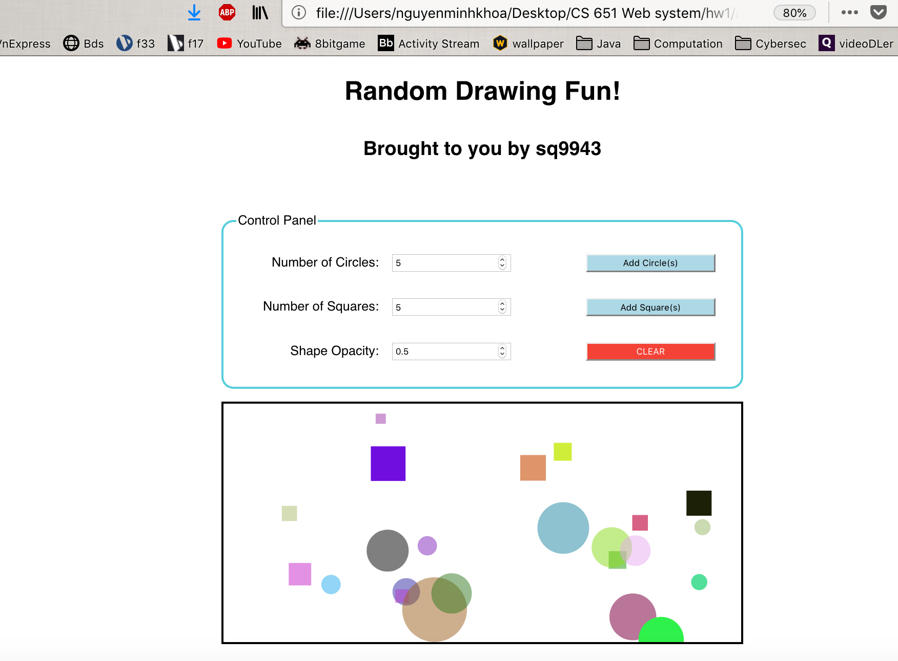
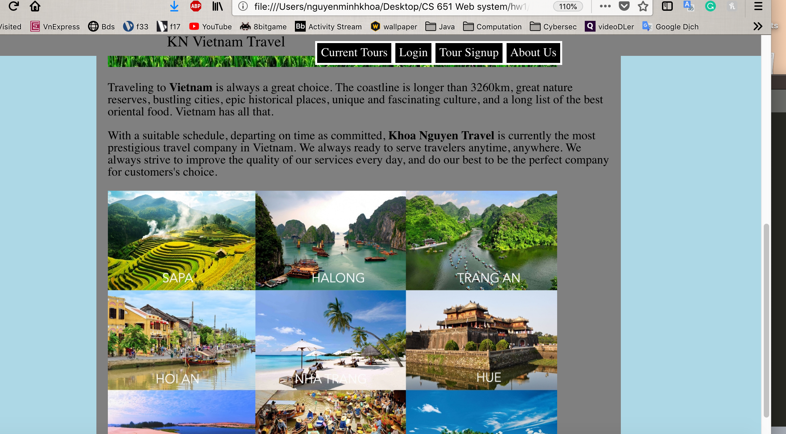

**Student Name**:  Khoa Nguyen

**NetID**: sq9943

# Homework #4 Solutions

## Question 1 
### (a)

I get v10.16.3 as my Node.js version, and 6.9.0 as my NPM version.

### (b)

### (c)

### (d)


## Question 2
### (a)

### (b)


### (c)

## Question 3
### (a)

### (b)

### (c)

```css
.button {
  background-color: #add8e6;
  color: black;
  cursor: pointer;
  
}
.button1 {
  background-color: #f44336;
  color: white;
  cursor: pointer;
}

#cp {
  padding: 1em;
  margin: auto;
  border: solid #55cedc;
  border-radius: 15px;
}
#cp section {
  display: grid;
  grid-template-columns: 10em 14em 10em;
  padding: 1em;
  grid-row-gap:1em;
  grid-column-gap: 1em;
  margin: auto;
  border-radius: 15px;
  max-width: 40em;
}
#cp label {
  align-self: center;
  text-align: right;
  display: block;
}

form {
  padding: 1em;
  background: none;
  border: none;
  margin-top: 2rem;
  margin-left: auto;
  margin-right: auto;
  padding: 1em;
}
svg {
  border: solid #000000;
  max-width: 645px;
  margin-left: auto;
  margin-right: auto;
  box-sizing: border-box;
}
body {
  display: flex;
  flex-direction: column;
  align-items: center;
  justify-content: space-around;
  font-family: sans-serif;
}

```

## Question 4
### (a)

### (b)


```html
<body>
    <nav>
    	<span>KN Vietnam Travel</span>
      <ul>
        <li><a href="hw2.html" target="_blank">Home</a></li>
        <li><a href="#">Current Tours</a></li>
        <li><a href="#">Login</a></li>
        <li><a href="signup.html" target="_blank">Tour Signup</a></li>
        <li><a href="#">About Us</a></li>
      </ul>
     </nav>
    <main>
      <div>
    	<header>
    		<h1>Newsletter Signup</h1>
    	</header>
    	
    </div>
    <div>
      <h2>Enter Your Information:</h2>
      <section id="f1">
  <label>First Name:</label> <input type="text" required>
  <label>Last Name:</label> <input type="text" required>
  <label>Email:</label><input type="text" required>
  <label>How did you hear about us?(optional)</label><input type="text">
  <label>Comments(optional)</label><textarea name="comments" rows="8" cols="20"></textarea>
  <button id="b1">Sign me up!</button>
</section>
```
```css
#f1 {
  display: grid;
  text-align: right;
  grid-template-columns: 10em 20em;
  padding: 1em;
  grid-row-gap:1em;
  grid-column-gap: 1em;
  margin: 0.5em;
  border: solid #55cedc;
  border-radius: 15px;
  max-width: 40em;
}
#b1{
  background-color: gold;
  cursor: pointer;
}
```

### (c)


```html
<nav id="bar">
    	<span id="s1">KN Vietnam Travel</span>
      <ul>
        <li><a href="hw2.html" target="_blank">Home</a></li>
        <li><a href="#">Current Tours</a></li>
        <li><a href="#">Login</a></li>
        <li><a href="signup.html" target="_blank">Tour Signup</a></li>
        <li><a href="#">About Us</a></li>
      </ul>
</nav>
```

```css
li {
  float: left;
}

li a {
  
  color: white;
  padding: 5px 5px;
  text-decoration: none;
  border: solid white;
  overflow: hidden;
  background-color: black;

}
ul {
list-style: none;
}

li a:hover {
  background-color: gray;
}

main {
  margin-top: 40px;
  margin-left: auto;
  margin-right: auto;
  background-color: gray;
  max-width: 700px;

}

body {
  background-color: lightblue;
}

div {
  padding: 15px 15px;
}


#f1 {
  display: grid;
  text-align: right;
  grid-template-columns: 10em 20em;
  padding: 1em;
  grid-row-gap:1em;
  grid-column-gap: 1em;
  margin: 0.5em;
  border: solid #55cedc;
  border-radius: 15px;
  max-width: 40em;
}
#s1{
  font-size: 20px;
  font-family: serif; 
}
#b1{
  background-color: gold;
  cursor: pointer;
}
#bar {
  display: flex;
  justify-content:center;
  position: fixed;
  top: 0;
  width: 100%; 
  height: 5%;
  background-color: gray;
  max-width: 1200px;
}
```

## Question 5
### (a) 

### (b)

[Drawing App](http://csweb01.csueastbay.edu/~sq9943/randomDrawing.html).

[Tour Site](http://csweb01.csueastbay.edu/~sq9943/hw2.html).