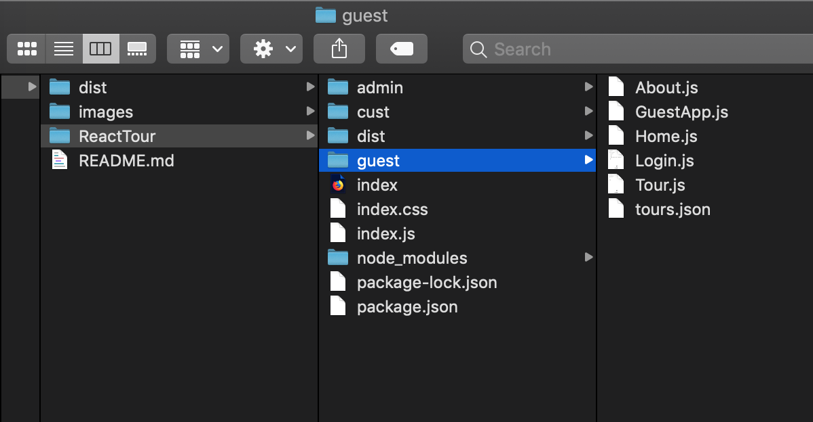
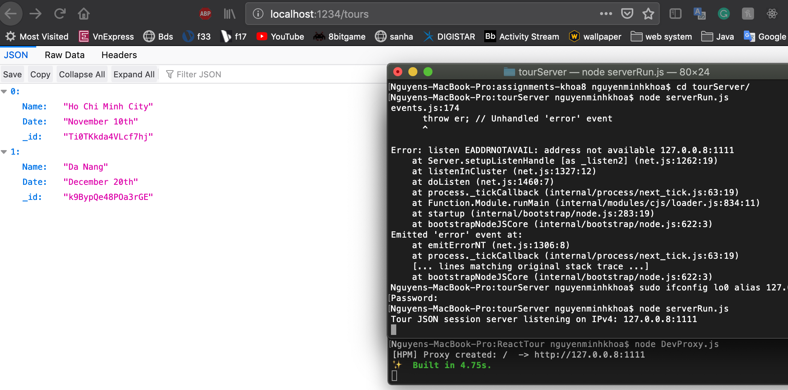
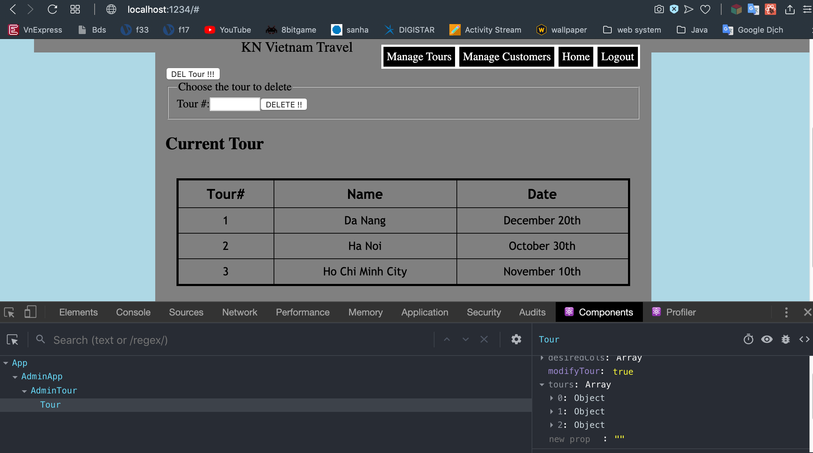
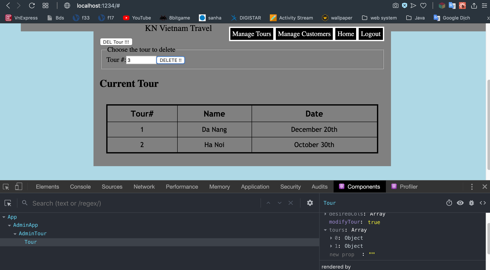

**Student Name**:  Khoa Nguyen

**NetID**: sq9943

# Homework #6 Solutions

## Question 1 
### (a)



### (b)



### (c)


### (d)
```javascript
constructor(props) {
        super(props);
        this.state = {role: "admin", showing: "tour", add: false, modifyTour: true, addName: "", addDate: "", ctours: tours};
        this.addHandler = this.addHandler.bind(this);
        this.addtour = this.addtour.bind(this);
    }
```
### (e)
```javascript
<input onClick={this.addHandler.bind(this)} type="button" value="Add Tour" />
{this.state.add &&
<form>
<fieldset>
<legend>Fill out the info below</legend>
<label>Name:</label><input ref={el1 => this.element1 = el1} type="text" size="50" /><br /><br />
<label>Date:</label><input ref={el2 => this.element2 = el2} type="text" size="50" /><br /><br />
<input onClick={this.addtour.bind(this)} type="button" value="ADD" /><br />
</fieldset>
</form>
}
```

### (f)
```javascript
addHandler(event){
    this.setState({add: !this.state.add});
    }
addtour(event){
    this.setState({addName: this.element1.value });
    this.setState({addDate: this.element2.value });
    this.setState({ctours: this.state.ctours.concat({"Name" : this.element1.value, "Date" : this.element2.value})});
    }
```

## Question 2
### (a)





### (b)

```javascript
<input onClick={this.delHandler.bind(this)} type="button" value="DEL Tour !!!" />
{this.state.del &&
<form>
<fieldset>
<legend>Choose the tour to delete</legend>
<label>Tour #:</label><input ref={el3 => this.element3 = el3} type="text" size="10" />
<input onClick={this.deltour.bind(this)} type="button" value="DELETE !!" /><br />
</fieldset>
</form>
}
<h2>Current Tour</h2>
<Tour tours={this.state.ctours} desiredCols={cols} modifyTour={this.state.modifyTour} />
```
### (c)

```javascript
delHandler(event){
    this.setState({del: !this.state.del});
    } 
deltour(event) { 
    let val = this.element3.value;
    this.setState({ctours: this.state.ctours.filter(function(value){
                            return value["Tour#"] !== val;
                            })
                            });
    }
```

## Question 3
### (a) Your Network Interfaces


### (b1) Ethernet Address of your machine(s)


### (b2) Type of IP Addresses of your machine


### (c) IP Address of a public website - csueastbay.edu 

```code
134.154.136.39
```
### (d) Where is the server?


## Question 4
### (a)

2 purposes:

-Pointing to an instance of an object from its own constructor or its methods. 

-Keeping track of execution context — which is often based on where a function was called from.

### (b)

this #1 : object Window // In a general function, this refers to the global object.
this #2 : instance of myObj1 pointed from its method // In a method, this refers to the owner object.
this #3 : instance of myObj2 // with bind(), this refers to the wrapped object in bind()

### (c)

```code
Is this the start?
When does this print?
Is this the end?
undefined
this is a msg from CS651
This is a msg from CS351
```
#### Explain:

There are 3 messages in the queue: console.log('Is this the start?'), console.log('When does this print?'), console.log('Is this the end?').
So, the setTimeout messages will have to wait for other messages to be processed eventhough the time values are 0 and default (means 0, too). After that, the setTimeout(cs651) will be printed next because it's on the queue before the setTimeout(cs351, 0); finally, print the message from setTimeout(cs351, 0).

### (d)

The code returns a promise that fulfills (resolves) as soon as one of the promises in an iterable (array) fulfills after a random time of each, with the value (name) from that promise. Then with the function "winner", the code wants to show the name of winner of the “promise race".

```code
myPs = [myP1, myP2, myP3];
racingPs = Promise.race(myPs);
racingPs.then(function(value) {
    winner(value);
});
```