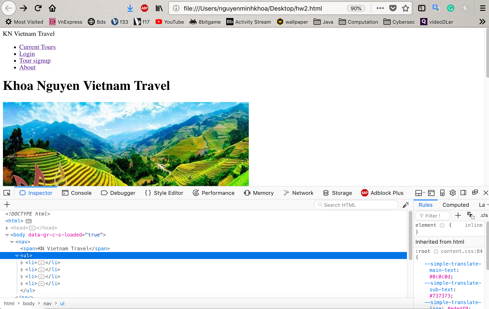
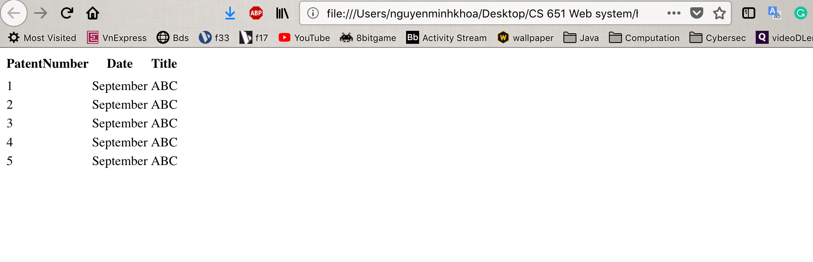

**Student Name**:  Khoa Nguyen

**NetID**: sq9943

# Homework #2 Solutions

## Question 1 
### (a)

### (b)

### (c)




## Question 2
### (a)


### (b)


## Question 3
### (a)


```javascript
array=document.querySelectorAll('.publication');
for (var i=0;i<array.length;i++) {
	array[i].innerHTML = '<strong style=\'color:blue;\'>' +(i+1)+ ' (sq9943). </strong>' +array[i].innerText;
}
```

### (b)
```javascript
array=document.querySelectorAll('.patent');
var array2 = [];
var o = {};
for (i=0;i<array.length;i++) {
o.patNum = document.getElementsByClassName('PatNum')[0].innerText;
o.title = document.getElementsByClassName('Title')[0].innerText;
o.date = document.getElementsByClassName('Date')[0].innerText;
array2[i] = o;
}
array2;  <!-- call array2 to copy array of objects to the patentInfo.js -->
```

## Question 4
### (a)

### (b)

## Question 5
### (a) 

### (b)



```javascript

<!-- this is just a hard code for testing the function with out file patentInfo.js
let patentInfo = [
  { PatentNumber: 1, Date: "September", Title: "ABC" },
  { PatentNumber: 2, Date: "September", Title: "ABC" },
  { PatentNumber: 3, Date: "September", Title: "ABC" },
  { PatentNumber: 4, Date: "September", Title: "ABC" },
  { PatentNumber: 5, Date: "September", Title: "ABC" }
];
-->

function generateTableHead(table, data) {
  let thead = table.createTHead();
  let row = thead.insertRow();
  for (let key of data) {
    let th = document.createElement("th");
    let text = document.createTextNode(key);
    th.appendChild(text);
    row.appendChild(th);
  }
}

function generateTable(table, data) {
  for (let element of data) {
    let row = table.insertRow();
    for (key in element) {
      let cell = row.insertCell();
      let text = document.createTextNode(element[key]);
      cell.appendChild(text);
    }
  }
}

let table = document.querySelector("table");
let data = Object.keys(patentInfo[0]);
generateTable(table, patentInfo);
generateTableHead(table, data);
```