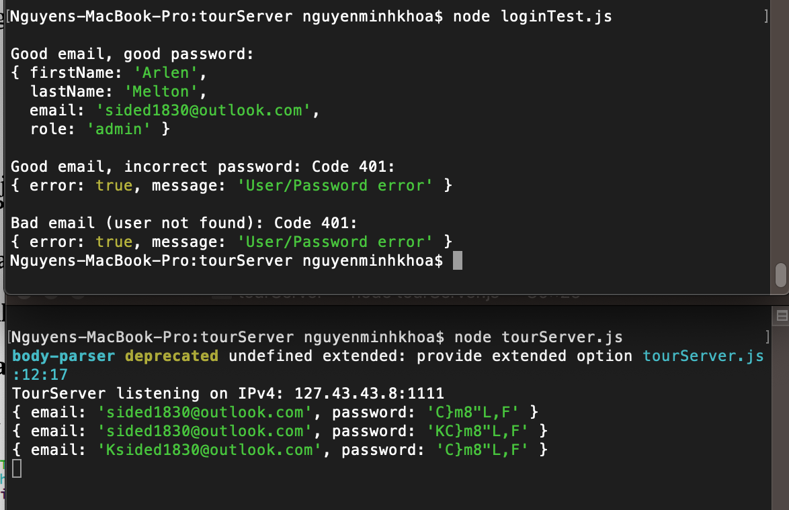

**Student Name**:  Khoa Nguyen

**NetID**: sq9943

# Homework #9 Solutions

## Question 1 
### (a) 

```code
const DataStore = require('nedb-promises');
const db = DataStore.create(__dirname + '/usersDB');
const users = require('./users.json');

async function initialize() {
    try {
        let numRemoved = await db.remove({}, {multi: true});
        console.log(`Cleanup, removed ${numRemoved} users`);
        let newDocs = await db.insert(users);
        console.log(`Added ${newDocs.length} users`);
    } catch (err) {
        console.log(`Database error: ${err}`);
    }
}

initialize();
```

### (b)

```code
const DataStore = require('nedb-promises');
const db = DataStore.create(__dirname + '/toursDB');
const tours = require('./tours.json');

async function initialize() {
    try {
        let numRemoved = await db.remove({}, {multi: true});
        console.log(`Cleanup, removed ${numRemoved} tours`);
        let newDocs = await db.insert(tours);
        console.log(`Added ${newDocs.length} tours`);
    } catch (err) {
        console.log(`Database error: ${err}`);
    }
}

initialize();
```

## Question 2
### (a)
```code
app.get('/tours', function (req, res) {
    db.find({}, function(err, docs) {
    if (err) {
        console.log("something is wrong");
    } else {
        console.log("We found " + docs.length + " documents");
        console.log(docs);
        res.json(docs);
    }
    });
});
```

### (b)

(i) Two-factor authentication is a security process in which the users provide two different authentication factors to verify themselves.

(ii) Example: when withdrawing of money from an ATM, user must use a correct bank card (something the user has) and a correct PIN (something the user knows).

(iii) It is not hackproof. It just provides stronger authentication.

### (c)

(i) Example: CSUEB BlackBoard. This system has the access control for different roles: admin, student, teacher, grader, staffs. Each role has specific views and access level.

(ii) Role Based Access Control (RBAC) is a method of restricting network access based on the roles of individual users within an enterprise. RBAC lets users have access rights only to the information they need to do their jobs and prevents them from accessing information that doesn't pertain to them. (from techtarget.com)

### (d)

It is important to keep logs of various activities associated with the web app because it's helpful in identifying critical network issues, malicious attacks on the system, or some other suspicious system activities like unauthorized logins, login failures, and errors on network devices.

## Question 3
### (a)

```code
hashedUsers = users.map(data =>{
    let salt = bcrypt.genSaltSync(nRounds);
    let passHash = bcrypt.hashSync(data.password, salt);

    return {
        "firstName": data.firstName,
        "lastName" : data.lastName,
        "email": data.email,
        "passHash": passHash,
        "role": data.role
    };
 
});
```

```code
{
    "firstName": "Arlen",
    "lastName": "Melton",
    "email": "sided1830@outlook.com",
    "passHash": "$2a$10$wLw5wfjKqOuyQUgj9V6BLORXXaih.3FwMYNbCMwvwqn4ZOrYRF8C.",
    "role": "admin"
  },
  {
    "firstName": "Luna",
    "lastName": "Munoz",
    "email": "sylvan2059@live.com",
    "passHash": "$2a$10$4SEhyH8knJg5kaA6z7zeROg2UVw6fAYhtzsDy2dzHc6MPj35P9k32",
    "role": "customer"
  }
```

### (b)


## Question 4
### (a)

```code
const data = require('./userTourHash.json');
const bcrypt = require('bcryptjs');

app.post('/login', function (req, res) {
    console.log(req.body);
    let email = req.body.email;
    let password = req.body.password;
    let user = data.find( u => {
        return u.email === email
    });
    if (user) {
    	let verified = bcrypt.compareSync(password, user.passHash);
    	if (verified) {
    	    res.json({
            "firstName": user.firstName,
            "lastName" : user.lastName,
            "email": user.email,
            "role": user.role
            });
        } else {
            res.status(401).json({error: true, message: "Password error"});
    	}
	} else {
        res.status(401).json({error: true, message: "User error"});
    }   
});
```
## Question 5

### (a)

```code

const fetch = require("node-fetch");

fetch("http://127.43.43.8:1111/login", {
    method: 'POST',
    body: JSON.stringify({email: "sided1830@outlook.com", password: 'C}m8\"L,F'}),
    headers: { "Content-Type": "application/json" }
  }).then((res) => res.json())
  .then((data) => {
    console.log('');
    console.log('Good email, good password: ');
    console.log(data);
  })
  .catch((err) => console.log(err))

fetch("http://127.43.43.8:1111/login", {
    method: 'POST',
    body: JSON.stringify({email: "sided1830@outlook.com", password: 'KC}m8\"L,F'}),
    headers: { "Content-Type": "application/json" }
  }).then((res) => res.json())
  .then((data) => {
    console.log('');
    console.log('Good email, incorrect password: Code 401: ')
    console.log(data);
  })
  .catch((err) => console.log(err))

fetch("http://127.43.43.8:1111/login", {
    method: 'POST',
    body: JSON.stringify({email: "Ksided1830@outlook.com", password: 'C}m8\"L,F'}),
    headers: { "Content-Type": "application/json" }
  }).then((res) => res.json())
  .then((data) => {
    console.log('');
    console.log('Bad email (user not found): Code 401: ')
    console.log(data);
  })
  .catch((err) => console.log(err))
```

