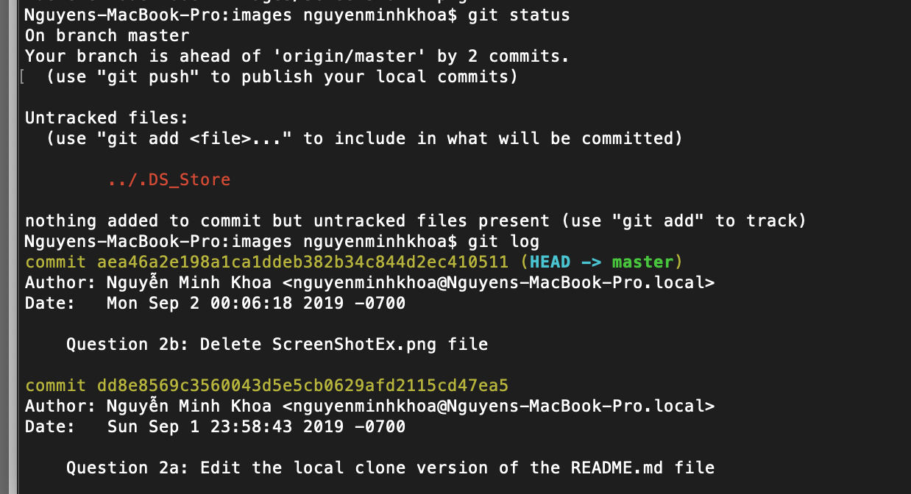

**Student Name**:  Khoa Nguyen

**NetID**: sq9943

# Homework #1 Solutions

## Question 1 
### (a)


### (b)


## Question 2
### (a-b)



### (c)


## Question 3
### (a)

### (b)

## Question 4
### (a)

1. C/C++
2. Java
3. Python

### (b)

* MacOS
* Windows

### (c)

* Xcode
* NetBeans
* Eclipse
* Sublime Text

## Question 5
### (a) **Code sample**

```c++
#include <iostream> //sample code in c++
using namespace std;
int main(){
   for(int i=1; i<=6; i++){
      cout<<"i = "<<i<<endl;
   }
   cout<<"End of sample.\n";
   return 0;
}
```

### (b) **Links**

***Xcode*** is an integrated development environment (IDE) for macOS containing a suite of software development tools developed by Apple for developing software for macOS, iOS, iPadOS, watchOS, and tvOS. First released in 2003, the latest stable release is version 10.3 and is available via the Mac App Store free of charge for macOS Mojave users. Registered developers can download preview releases and prior versions of the suite through the [Apple Developer website](https://developer.apple.com/xcode/). (from [Wiki](https://en.wikipedia.org/wiki/Xcode))