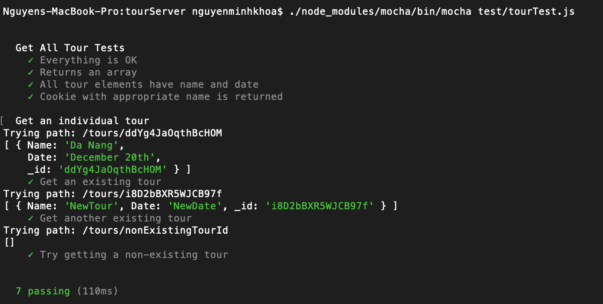

**Student Name**:  Khoa Nguyen

**NetID**: sq9943

# Homework #8 Solutions

## Question 1 
### (a) Confidentiality

(i) Confidentiality refers to protecting information from being accessed by unauthorized parties. In other words, only the people who are authorized to do so can gain access to sensitive data. (from lecture and MDN)

(ii) An example
Capital One has announced that nearly 106 million customer accounts and credit card applications have been compromised.

Breach announced: August 4, 2019

Breach Period: 2005-March 23, 2019

Description of the breach: Capital One has announced that many of their customers’ Social Security numbers, Canadian Social Insurance numbers, bank account numbers, names, addresses, credit scores, credit limits, and account balances have been compromised. No login credentials were exposed in the breach.

(iii) A breach of confidentiality

### (b) Integrity

(i) We need to ensure that software is not altered, and that the source of the software is genuine.

(ii) To assure the integrity of some of the open source software:

- Using digital signature
- Using File Integrity Monitoring software to monitor changes in files.


### (c) Availability

(i) Denial-of-service attack (DoS attack)

(ii) Yes. Because it can disrupt the service.

## Question 2
### (a)

(i) Credential stuffing is a type of cyberattack where stolen account credentials typically consisting of lists of usernames and/or email addresses and the corresponding passwords are used to gain unauthorized access to user accounts through large-scale automated login requests directed against a web application. (from Wiki)

Users should not use the same passwords for different websites because if one of these website is attacked, hacker can use the user data from that website to gain access to other websites. 

### (b)

(i) Two-factor authentication is a security process in which the users provide two different authentication factors to verify themselves.

Example: when withdrawing of money from an ATM, user must use a correct bank card (something the user has) and a correct PIN (something the user knows).

It is not hackproof. It just provides stronger authentication.

### (c)

(i) Example: CSUEB BlackBoard. This system has the access control for different roles: admin, student, teacher, grader, staffs. Each role has specific views and access level.

(ii) Role Based Access Control (RBAC) is a method of restricting network access based on the roles of individual users within an enterprise. RBAC lets users have access rights only to the information they need to do their jobs and prevents them from accessing information that doesn't pertain to them. (from techtarget.com)

### (d)

It is important to keep logs of various activities associated with the web app because it's helpful in identifying critical network issues, malicious attacks on the system, or some other suspicious system activities like unauthorized logins, login failures, and errors on network devices.

## Question 3
### (a)


### (b)


### (c)


```code
const express = require('express');

const app = express();
const port = 1111;
const host = '127.43.43.8';
let name = 'Khoa Nguyen';
let netid = 'sq9943';
let dateTime = new Date();

app.get('/', (req, res) => res.send(`${dateTime} Name: ${name}, NetID: ${netid}`))

app.listen(port, host,  () => console.log(`Combine app listening on IPv4: ${host}:${port}`))
```

## Question 4
### (a)



```code
const express = require('express');
const data = require('./tours.json');

const app = express();
const port = 1111;
const host = '127.43.43.8';

app.get('/tours', (req, res) => res.send(data))

app.listen(port, host,  () => console.log(`TourServer listening on IPv4: ${host}:${port}`))
```

### (b)


```code
const request_promise = require('request-promise-native'); 

let site = { 
    uri: 'http://127.43.43.8:1111/tours', 
    json: true 
}; 
    
request_promise(site).then(function(data){ 
    data.map((element, index) => {
        console.log(`Tour ${index+1} name ${element.Name}, date: ${element.Date}`);
})});
```

## Question 5

### (a)

```code
app.use(bodyParser.json());
app.use(bodyParser.urlencoded({extended: true}));
app.use(express.json());
app.use(express.urlencoded());
app.post('/tours/add', (req, res) => {
    data.push(req.body);
    console.log(req.body);
    res.json(req.body);
})
```
### (b)


```code
const request_promise = require('request-promise-native'); 
const fetch = require("node-fetch");

let site = { 
    uri: 'http://127.43.43.8:1111/tours', 
    json: true 
}; 
fetch("http://127.43.43.8:1111/tours/add", {
    method: 'POST',
    body: JSON.stringify({Name: 'new!', Date: 'unknow!'}),
    headers: { "Content-Type": "application/json" }
  }).then((res) => res.json())
  .then((data) => console.log(data))
  .catch((err) => console.log(err))   
request_promise(site).then(function(data){ 
    data.map((element, index) => {
        console.log(`Tour ${index+1} name ${element.Name}, date: ${element.Date}`);
})});
```