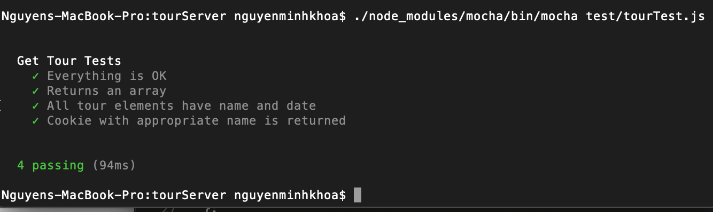

**Student Name**:  Khoa Nguyen

**NetID**: sq9943

# Homework #10 Solutions

## Question 1 

### (a) See all tours
HTTP GET

/tours

Success: 200 (OK)

Error: 404 (NOT FOUND), 400 (BAD REQUEST)

Roles: guest, admin, customer

### (b) Get info on a specific tour
HTTP GET

/tours/{tourId}

Success: 200 (OK)

Error: 404 (NOT FOUND), 400 (BAD REQUEST)

Roles: guest, admin, customer

### (c) Add a new tour
HTTP POST

/tours

Success: 201 (CREATED)

Error: 400 (BAD REQUEST)

Roles: admin

### (d) Edit a tour
HTTP PUT

/tours/{tourId}

Success: 200 (OK), 204 (NO CONTENT)

Error: 404 (NOT FOUND)

Roles: admin


### (e) Delete a tour
HTTP DELETE

/tours/{tourId}

Success: 200 (OK)

Error: 404 (NOT FOUND)

Roles: admin


## Question 2

### (a) Allow a user to see all the tours they are signed up for
HTTP GET

/users/{userId}/signed-up-tours

Success: 200 (OK)

Error: 404 (NOT FOUND)

Role: customer

### (b) Allow a user to signup (only themselves) for a tour (if there is room)
HTTP POST

/users/{userId}/signed-up-tours

Success: 201 (CREATE)

Error: 400 (BAD REQUEST)

Role: customer

### (c) Allow a user to remove themselves from a tour (only themselves, if they are signed up)
HTTP DELETE

/users/{userId}/signed-up-tours/{tourId}

Success: 200 (OK)

Error: 404 (NOT FOUND)

Role: customer

### (d) Get all the customers signed up on a particular tour
HTTP GET

/users/{adminId}/tours/{tourId}/signed-up-customers

Success: 200 (OK)

Error: 404 (NOT FOUND)

Role: admin

## Question 3
### (a)

```code
const session = require('express-session');
const cookieName = "sq9943";
app.use(session({
    secret: 'khoa',
    resave: false,
    saveUninitialized: false,
    name: cookieName
}));

const setUpSessionMiddleware = (req, res, next) => {
    console.log(`session object: ${JSON.stringify(req.session)}`);
    console.log(`session id: ${req.session.id}`);
    if (!req.session.user) {
        req.session.user = {role: "guest"};
    };
    next();
};

app.use(setUpSessionMiddleware);
```

### (b)



### (c)

```code
app.post('/login', express.json(), async (req, res) => {
    try {
    console.log(req.body);
    let Email = req.body.email;
    let Password = req.body.password;
    
    let auser = await db2.findOne({email: Email});
    if (!auser) {
        res.status(401).json({error: true, message: "User/Password error"});
        return;
    }
    if (Password === auser.password) {
        let oldInfo = req.session.user;
        req.session.regenerate(function (err) {
            if (err) {console.log(err);
            }
        let newUserInfo = Object.assign(oldInfo, auser);
        delete newUserInfo.password;
        req.session.user = newUserInfo;
        res.json(newUserInfo);
    });
    } else {
        res.status(401).json({error: true, message: "User/Password error"});
    }
    } catch (err) {
        console.log(`Database error: ${err}`);
    }
});
```

### (d)

```code
app.get('/logout', function (req, res) {
    let options = req.session.cookie;
    req.session.destroy(function (err) {
        if (err) {
            console.log(err);
        }
        res.clearCookie(cookieName, options); // the cookie name and options
        res.json({message: "Goodbye"});
    })
});
```
### (e)

```code
const rp = require('request-promise-native');
const cookieJar = rp.jar();
let tourSite = {
    uri: 'http://127.43.43.8:1111/tours',
    json: true,
    jar: cookieJar
};

let logout = { 
    uri: 'http://127.43.43.8:1111/logout', 
    json: true,
    jar: cookieJar
}; 

let loginGood = {
    uri: 'http://127.43.43.8:1111/login',
    json: true,
    method: "POST",
    body: {"email": "sylvan2059@live.com",
    "password": "1wQX_lYt"},
    jar: cookieJar
};

let loginBadEmail = {
    uri: 'http://127.43.43.8:1111/login',
    json: true,
    method: "POST",
    body: {"email": "sylvan205@live.com",
    "password": "1wQX_lYt"},
    jar: cookieJar
};

let loginBadPass = {
    uri: 'http://127.43.43.8:1111/login',
    json: true,
    method: "POST",
    body: {"email": "sylvan2059@live.com",
    "password": "2wQX_lYt"},
    jar: cookieJar
};


async function someTests() {
    let res1, res2, res3;
    try {
        console.log(`TEST 1:\n`);
        res1 = await rp(tourSite);
        console.log(`cookies: ${cookieJar.getCookieString(tourSite.uri)}`);
        res2 = await rp(loginGood);
        console.log(`Good login test result: ${JSON.stringify(res2)}\n`);
        console.log(`cookies: ${cookieJar.getCookieString(loginGood.uri)}`);
        res3 = await rp(logout);
        console.log(`Logout result: ${JSON.stringify(res3)}\n`);
        console.log(`cookies: ${cookieJar.getCookieString(logout.uri)}`);
    } catch (error) {
    console.log(`Good login error: ${error}\n`);
    }
    try {
        console.log(`TEST 2:\n`);
        res1 = await rp(tourSite);
        console.log(`cookies: ${cookieJar.getCookieString(tourSite.uri)}`);
        res2 = await rp(loginBadEmail);
        console.log(`Bad email login test result: ${JSON.stringify(res2)}\n`);
        console.log(`cookies: ${cookieJar.getCookieString(loginBadEmail.uri)}`);
    } catch (error) {
    console.log(`Bad email login error: ${error}`);
    }
    try {
        console.log(`TEST 3:\n`);
        res1 = await rp(tourSite);
        console.log(`cookies: ${cookieJar.getCookieString(tourSite.uri)}`);
        res2 = await rp(loginBadPass);
        console.log(`Bad password login test result: ${JSON.stringify(res2)}\n`);
        console.log(`cookies: ${cookieJar.getCookieString(loginBadPass.uri)}`);
    } catch (error) {
    console.log(`Bad password login error: ${error}\n`);
    }
}

someTests();
```


## Question 4
### (a)

```code
const checkAdminMiddleware = (req, res, next) => {
    if (req.session.user.role !== "admin") {
        res.status(403).json({error: "Forbidden/Not permitted"});
    } else {
        next();
    }
};
```

### (b)

```code
const rp = require('request-promise-native');
const DataStore = require('nedb-promises');
const db = DataStore.create(__dirname + '/toursDB');
const cookieJar = rp.jar();

let tourSite = {
    uri: 'http://127.43.43.8:1111/tours',
    json: true,
    jar: cookieJar
};

let add = {
    uri: 'http://127.43.43.8:1111/addTours',
    json: true,
    method: "POST",
    body: {"Name": "NewTour",
    "Date": "NewDate"},
    jar: cookieJar
};

let logout = { 
    uri: 'http://127.43.43.8:1111/logout', 
    json: true,
    jar: cookieJar
}; 

let adminlogin = {
    uri: 'http://127.43.43.8:1111/login',
    json: true,
    method: "POST",
    body: {"email": "sided1830@outlook.com",
    "password": "C}m8\"L,F"},
    jar: cookieJar
};

let custlogin = {
    uri: 'http://127.43.43.8:1111/login',
    json: true,
    method: "POST",
    body: {"email": "sylvan2059@live.com",
    "password": "1wQX_lYt"},
    jar: cookieJar
};


async function someTests() {
    let res1, res2, res3, res4, res5;
    try {
        console.log(`TEST 1:\n`);
        res1 = await rp(adminlogin);
        console.log(`Admin login test result: ${JSON.stringify(res1)}\n`);
        console.log(`cookies: ${cookieJar.getCookieString(adminlogin.uri)}\n`);
        res2 = await db.find({});
        console.log(`Number of tours: ${res2.length} tours\n`);
        let ps = [rp(add),db.find({})];
        [res3, res4] = await Promise.all(ps);
        console.log(`After adding, number of tours: ${res3.length} tours\n`);
        res5 = await rp(logout);
        console.log(`Logout result: ${JSON.stringify(res5)}\n`);
        console.log(`cookies: ${cookieJar.getCookieString(logout.uri)}\n`);
    } catch (error) {
    console.log(`Admin login error: ${error}\n`);
    }
    try {
        console.log(`TEST 2:\n`);
        res1 = await rp(custlogin);
        console.log(`Customer login test result: ${JSON.stringify(res1)}\n`);
        console.log(`cookies: ${cookieJar.getCookieString(custlogin.uri)}\n`);
        let ps = [rp(tourSite),db.find({})];
        [res2,res5] = await Promise.all(ps);
        console.log(`Number of tours: ${res2.length} tours\n`);
        res3 = await rp(add);
        res4 = await rp(logout);
        console.log(`Logout result: ${JSON.stringify(res4)}\n`);
        console.log(`cookies: ${cookieJar.getCookieString(logout.uri)}\n`);
    } catch (error) {
    console.log(`Customer add tour error: ${error}`);
    }
    try {
        console.log(`TEST 3:\n`);
        let ps = [rp(tourSite),db.find({})];
        [res1,res2] = await Promise.all(ps);
        console.log(`cookies: ${cookieJar.getCookieString(tourSite.uri)}\n`);
        console.log(`Number of tours: ${res1.length} tours\n`);
        res3 = await rp(add);
    } catch (error) {
    console.log(`Guest add tour error: ${error}\n`);
    }
}

someTests();
```

