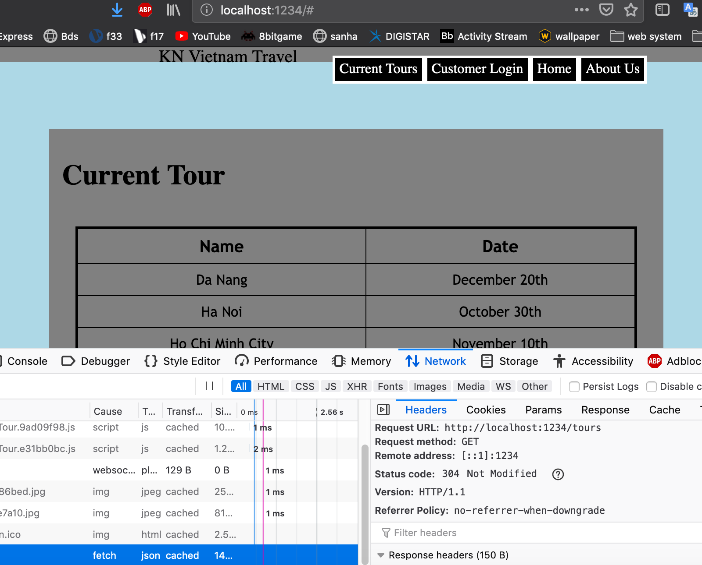

**Student Name**:  Khoa Nguyen

**NetID**: sq9943

# Homework #4 Solutions

## Question 1 
### (a)

I get v10.16.3 as my Node.js version, and 6.9.0 as my NPM version.

### (b)

### (c)

### (d)


## Question 2
### (a)

### (b)



### (c)


## Question 3
### (a)

### (b)

```html
<body>
    <h1>Markdown to HTML Converter</h1>
  	<h2>Type Markdown here</h2>

<div id="d1">
	<textarea name="comments" id="input" rows="11" cols="80" wrap=on></textarea>
	
</div>
	<button type="button" id="b1">Convert to HTML</button>
	<h3>Rendered HTML</h3>
<div id="d2">
	
</div>


</body>
```

```javascript
import commonmark from "commonmark";

function convert(){

var reader = new commonmark.Parser();
var writer = new commonmark.HtmlRenderer();
var parsed = reader.parse(document.getElementById("input").value);
var result = writer.render(parsed);

document.getElementById("d2").innerHTML +=result;
}

window.onload = function() {
  document.getElementById("b1").addEventListener("click",convert);
}
```


## Question 4
### (a)

We can import CSS to the js file. Because the build tool processes CSS from JavaScript entry point, we can import the stylesheet directly into CommonJS-module.

### (b)

```javascript
import commonmark from "commonmark";
import hljs from 'highlight.js';
import 'highlight.js/styles/idea.css';

function convert(){

var reader = new commonmark.Parser();
var writer = new commonmark.HtmlRenderer();
var parsed = reader.parse(document.getElementById("input").value);
var result = writer.render(parsed);
document.getElementById("d2").innerHTML +=result;
document.querySelectorAll('div').forEach((block) => {
    hljs.highlightBlock(block);
  });
}

window.onload = function() {
  document.getElementById("b1").addEventListener("click",convert);
}
```


### (c)


```html
<nav id="bar">
    	<span id="s1">KN Vietnam Travel</span>
      <ul>
        <li><a href="hw2.html" target="_blank">Home</a></li>
        <li><a href="#">Current Tours</a></li>
        <li><a href="#">Login</a></li>
        <li><a href="signup.html" target="_blank">Tour Signup</a></li>
        <li><a href="#">About Us</a></li>
      </ul>
</nav>
```

```css
li {
  float: left;
}

li a {
  
  color: white;
  padding: 5px 5px;
  text-decoration: none;
  border: solid white;
  overflow: hidden;
  background-color: black;

}
ul {
list-style: none;
}

li a:hover {
  background-color: gray;
}

main {
  margin-top: 40px;
  margin-left: auto;
  margin-right: auto;
  background-color: gray;
  max-width: 700px;

}

body {
  background-color: lightblue;
}

div {
  padding: 15px 15px;
}


#f1 {
  display: grid;
  text-align: right;
  grid-template-columns: 10em 20em;
  padding: 1em;
  grid-row-gap:1em;
  grid-column-gap: 1em;
  margin: 0.5em;
  border: solid #55cedc;
  border-radius: 15px;
  max-width: 40em;
}
#s1{
  font-size: 20px;
  font-family: serif; 
}
#b1{
  background-color: gold;
  cursor: pointer;
}
#bar {
  display: flex;
  justify-content:center;
  position: fixed;
  top: 0;
  width: 100%; 
  height: 5%;
  background-color: gray;
  max-width: 1200px;
}
```

## Question 5
### (a) 

### (b)

[Drawing App](http://csweb01.csueastbay.edu/~sq9943/randomDrawing.html).

[Tour Site](http://csweb01.csueastbay.edu/~sq9943/hw2.html).